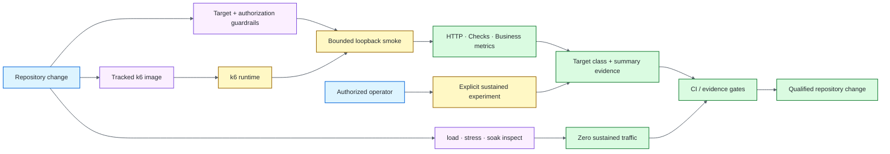

# k6 Performance Quality Engineering Framework

[](https://github.com/portyu9/qa-automation-load-k6/actions/workflows/ci.yml)
[](https://github.com/portyu9/qa-automation-load-k6/actions/workflows/extended.yml)
[](https://github.com/portyu9/qa-automation-load-k6/actions/workflows/security.yml)
[](https://github.com/portyu9/qa-automation-load-k6/actions/workflows/docs.yml)

[](https://k6.io/)
[](https://grafana.com/docs/k6/latest/using-k6/javascript-api/)
[](https://www.gnu.org/software/bash/)
[](https://www.docker.com/)
[](https://github.com/features/actions)
[](https://trivy.dev/)
[](LICENSE)
[](.github/SECURITY.md)

A k6 performance quality-engineering framework for **smoke, load, stress, and soak** analysis with explicit workload models, centralized thresholds, tagged business metrics, exact-host authorization, deterministic smoke execution, zero-traffic safety verification, target-class evidence, and machine-readable summaries.

> [!CAUTION]
> `load`, `stress`, and `soak` are controlled traffic experiments—not ordinary automated tests. Routine CI performs bounded loopback smoke and zero-traffic profile inspection; sustained traffic requires explicit target ownership, opt-in, and exact-host authorization.

**Start here:** [capabilities](#capabilities) · [architecture](#architecture) · [safety-model](#safety-model) · [quick-start](#quick-start) · [repository-map](#repository-map) · [documentation](#documentation)

## Capabilities

| Plane | Purpose | Traffic behavior | Evidence |
| --- | --- | --- | --- |
| Guardrails | Reject unsafe/missing target or authorization | **Zero traffic** | Shell/runtime contracts + `k6 inspect` |
| Packaged runtime | Prove image identity/startup safety | **Zero traffic** | Built image + `k6 version` |
| Smoke | Prove request/check/metric/summary path | Very low loopback volume | Structured summary |
| Extended profiles | Validate load/stress/soak scenario and threshold configuration | **Zero sustained traffic** | Resolved inspect evidence |
| Business metrics | Observe domain attempts/success/failure/duration | Same scenario traffic | Tagged custom metrics |
| Sustained experiments | Evaluate load, degradation, or endurance | Explicit operator execution | k6 metrics + thresholds/context |
| Security | Source, repository, runtime-image, dependency-change risk | No target traffic | CodeQL, Trivy, Dependency Review |
| Documentation | README/workflow/governance contracts | No target traffic | Documentation status |

## Architecture



k6 remains the native traffic engine; shared modules own configuration, authorization, threshold, client/metric, and evidence policy without creating a second load-test DSL. See [`docs/ARCHITECTURE.md`](docs/ARCHITECTURE.md) for the deeper target/runtime/workload boundaries.

## Safety model

Every traffic-capable invocation requires explicit `K6_BASE_URL`. Sustained `load`, `stress`, and `soak` additionally require:

```text
K6_BASE_URL=<explicit target>
AND
K6_ALLOW_LOAD_TEST=true
AND
target hostname is an exact member of K6_ALLOWED_HOSTS
```

Validated loopback hosts are classified as `local-fixture`; other validated hosts are `explicit-target`. **Classification is evidence, not authorization.** The shell wrapper and k6 runtime independently enforce sustained safety so direct `k6 run` cannot bypass the policy.

These controls reduce accidental targeting risk; environment ownership, change control, test windows, data safety, downstream capacity, incident controls, and observability remain operator responsibilities.

## Quick start

```bash
# start deterministic fixture
node scripts/local-api.js

# bounded smoke
K6_BASE_URL=http://127.0.0.1:4020 K6_RUN_ID=local-smoke bash scripts/run_k6.sh smoke

# zero-traffic guardrails
bash scripts/test_guardrails.sh

# packaged runtime starts with k6 version, not traffic
docker build -t qa-k6-runtime -f docker/Dockerfile .
docker run --rm qa-k6-runtime
```

Inspect a sustained profile without executing traffic:

```bash
K6_BASE_URL=https://example.invalid \
K6_ALLOW_LOAD_TEST=true \
K6_ALLOWED_HOSTS=example.invalid \
k6 inspect --include-system-env-vars tests/load.js
```

For runtime variables, workload models, metrics/threshold semantics, evidence interpretation, packaged runtime details, dependencies, and triage, see [`docs/OPERATIONS.md`](docs/OPERATIONS.md).

## Repository map

```text
.
├── .github/
├── docker/
├── docs/
├── lib/
├── scripts/
└── tests/
```

## Engineering contracts

- **No implicit target:** `K6_BASE_URL` is always explicit; public/demo services are never fallbacks.
- **Defense in depth:** shell and runtime independently reject unsafe sustained execution.
- **Routine CI safety:** pull-request workflows do not automatically run load/stress/soak traffic.
- **Deterministic smoke:** required smoke targets repository-owned `127.0.0.1:4020` at very low volume.
- **Workload clarity:** arrival rate, VU capacity, thresholds, checks, business metrics, and dropped iterations remain distinct concepts.
- **Central threshold policy:** common SLO expressions live in `lib/thresholds.js`; profile changes are deliberate.
- **Low-cardinality observability:** endpoint/scenario tags remain stable and explicit.
- **Contextual interpretation:** p95/threshold results are read with achieved demand, failures, checks, and generator health.
- **Safe image startup:** starting the project image without an explicit scenario runs `k6 version`, generating zero traffic.

## Packaged runtime provenance

[`docker/Dockerfile`](docker/Dockerfile) is the single tracked runtime source. The executing k6 binary is rebuilt from reviewed source identity and the governed security overrides `golang.org/x/crypto v0.56.0` and `google.golang.org/grpc v1.83.2`.

The final runtime overlays only the exact Alpine security packages `libcrypto3=3.5.8-r0` and `libssl3=3.5.8-r0`; broad `apk update` / `apk upgrade` operations are forbidden. The image runs as numeric non-root user `12345`.

The built image is **not claimed to be bit-for-bit reproducible from the Git commit alone** because external source/package retrieval and build-tool behavior remain inputs. Built-image Trivy evidence attests the OS and Go-binary package state actually produced by the governed build.

Runtime-marker updates are release signals rather than automatic binary switches: reviewed source/version provenance must remain synchronized and pass runtime, smoke, extended, and security qualification.

## Stable CI conclusions

| Stable status | Responsibility |
| --- | --- |
| `ci-gate` | Zero-traffic guardrails, runtime startup/identity, bounded local smoke, semantic summary evidence |
| `extended-gate` | Load/stress/soak `inspect` contracts with **zero sustained traffic** |
| `security-gate` | Supply-chain provenance, CodeQL, repository Trivy, built-image Trivy, Dependency Review when available |

The docs workflow exposes `static-contracts`. Workflow definitions: [`ci.yml`](.github/workflows/ci.yml) · [`extended.yml`](.github/workflows/extended.yml) · [`security.yml`](.github/workflows/security.yml) · [`docs.yml`](.github/workflows/docs.yml).

## Documentation

| Guide | Use it for |
| --- | --- |
| [`docs/ARCHITECTURE.md`](docs/ARCHITECTURE.md) | Target/configuration, authorization, fixture, runtime, workload, client/metric, evidence boundaries |
| [`docs/TEST_STRATEGY.md`](docs/TEST_STRATEGY.md) | Gate model, profile semantics, interpretation, exit criteria |
| [`docs/OPERATIONS.md`](docs/OPERATIONS.md) | Commands, runtime inputs, safety, workload models, metrics, evidence, runtime provenance, dependencies, triage |

The deeper workload, authorization, evidence, and performance-interpretation detail lives in `/docs`; the main README intentionally retains only the architecture diagram above.

## Design principle

A strong performance framework makes the experiment answerable: **what target was authorized/classified, what demand was requested and achieved, what HTTP/business signals reported, what threshold mattered, whether the runtime was controlled, and whether the generator became the bottleneck**.
