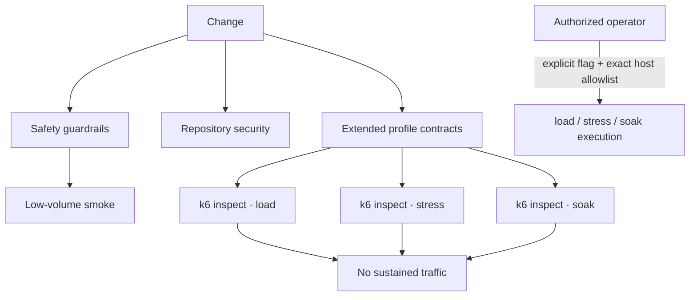
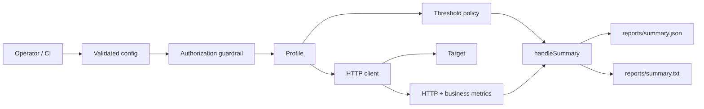
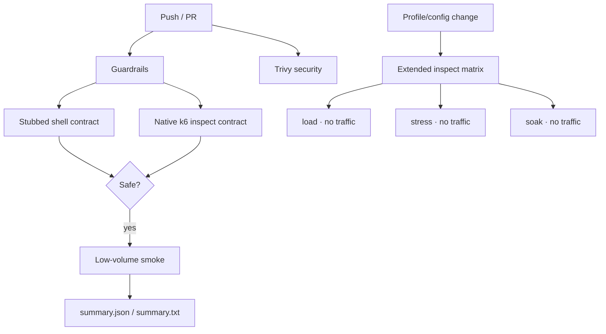

# k6 Performance Quality Engineering Framework

[](https://github.com/portyu9/qa-automation-load-k6/actions/workflows/ci.yml)
[](https://github.com/portyu9/qa-automation-load-k6/actions/workflows/extended.yml)
[](https://github.com/portyu9/qa-automation-load-k6/actions/workflows/security.yml)

[](https://k6.io/)
[](https://grafana.com/docs/k6/latest/using-k6/javascript-api/)
[](https://www.gnu.org/software/bash/)
[](https://www.docker.com/)
[](https://github.com/features/actions)
[](https://trivy.dev/)
[](LICENSE)
[](.github/SECURITY.md)

A k6 performance quality-engineering framework for smoke, load, stress, and soak analysis with explicit traffic models, centralized threshold policy, business metrics, target guardrails, zero-traffic safety verification, and machine-readable summaries. Ordinary CI executes only guardrail validation and a deliberately low-volume smoke profile. Sustained profiles require explicit operator intent and an exact target-host allowlist match.

> [!CAUTION]
> `load`, `stress`, and `soak` are not ordinary automated test cases. They generate intentional demand against a system. This repository treats authorization, target identity, traffic shape, generator capacity, and service thresholds as separate controls so a script cannot silently turn a routine CI event into sustained traffic.

## Capability map

| Plane | Question | Traffic behavior | Evidence |
| --- | --- | --- | --- |
| Guardrails | Can unsafe/missing sustained-load configuration be rejected? | **Zero traffic** | Shell contract + `k6 inspect` |
| Smoke | Does the script/target path work and satisfy basic budgets? | Very low volume | `summary.json`, `summary.txt` |
| Extended profiles | Do `load`/`stress`/`soak` initialize under authorized config? | **Zero traffic — inspect only** | Per-profile inspect artifacts + summary |
| Sustained load | Does expected demand satisfy service objectives? | Explicit operator execution only | k6 metrics + thresholds |
| Stress | Where does controlled degradation begin? | Explicit operator execution only | k6 metrics + threshold interpretation |
| Soak | Does stable demand expose cumulative degradation? | Explicit operator execution only | k6 metrics over time |
| Security | Dependency/configuration exposure in repository assets | No target traffic | Trivy JSON + Markdown summary |
| Observability | What did the smoke run measure and breach? | Native k6 summary | Actions summary + structured JSON |



## Engineering invariants

| Concern | Framework contract |
| --- | --- |
| Default safety | Automated CI validates guardrails first and runs smoke only. |
| Sustained authorization | `K6_ALLOW_LOAD_TEST=true` **and** exact hostname membership in `K6_ALLOWED_HOSTS`. |
| Target URL | Absolute HTTP(S), valid hostname/port, no credentials, query, or fragment. |
| Traffic model | Arrival-rate executors model requested demand independently from iteration duration. |
| Thresholds | Shared policy is generated centrally; profile deviations are explicit. |
| Business correctness | Domain failures are measured separately from HTTP transport failures. |
| Capacity | Dropped iterations are interpreted as a generator/scheduling signal, not automatically as service failure. |
| Diagnostics | Native structured summaries identify run/target, headline metrics, and threshold breaches. |
| Reproducibility | CI uses pinned `grafana/k6:2.2.0`. |

## Architecture



The design separates **target safety**, **demand model**, **request semantics**, **generator capacity**, **service objectives**, and **reporting**. Those concepts should never be collapsed into one pass/fail interpretation.

## Repository map

```text
.
├── docker/Dockerfile
├── lib/
│   ├── client.js
│   ├── config.js
│   ├── metrics.js
│   ├── summary.js
│   └── thresholds.js
├── scripts/
│   ├── run_k6.sh
│   └── test_guardrails.sh
├── tests/
│   ├── smoke.js
│   ├── load.js
│   ├── stress.js
│   └── soak.js
├── docs/
│   ├── ARCHITECTURE.md
│   └── TEST_STRATEGY.md
└── .github/workflows/
    ├── ci.yml
    ├── extended.yml
    └── security.yml
```

## Profile model

| Profile | Executor | Performance question | Automatic CI? |
| --- | --- | --- | --- |
| `smoke` | `shared-iterations` | Is the execution path healthy at negligible volume? | Yes |
| `load` | `ramping-arrival-rate` | Can normal operating demand satisfy declared budgets? | **No** |
| `stress` | `ramping-arrival-rate` | How does behavior degrade beyond the normal envelope? | **No** |
| `soak` | `constant-arrival-rate` | Does stable demand reveal time-dependent degradation? | **No** |

Smoke is a correctness/health signal. Load, stress, and soak are controlled experiments.

## Quick start

Low-volume smoke with local k6:

```bash
bash scripts/run_k6.sh smoke
```

Pinned container execution:

```bash
mkdir -p reports

docker run --rm \
  -e K6_BASE_URL=https://jsonplaceholder.typicode.com \
  -e K6_RUN_ID=local-smoke \
  -v "$PWD:/src" \
  -w /src \
  grafana/k6:2.2.0 \
  run tests/smoke.js
```

Validate the shell guardrail without traffic:

```bash
bash scripts/test_guardrails.sh
```

Inspect a sustained profile without executing it:

```bash
K6_BASE_URL=https://example.invalid \
K6_ALLOW_LOAD_TEST=true \
K6_ALLOWED_HOSTS=example.invalid \
k6 inspect --include-system-env-vars tests/load.js
```

> [!NOTE]
> `k6 inspect` evaluates module/configuration initialization. It does not execute the sustained scenario. The extended workflow uses this distinction deliberately.

## Runtime configuration

| Variable | Purpose | Default |
| --- | --- | --- |
| `K6_BASE_URL` | Target base URL | `https://jsonplaceholder.typicode.com` |
| `K6_RUN_ID` | Cross-system run correlation | generated ID |
| `K6_P95_MS` | Default p95 budget | `500` |
| `K6_ERROR_RATE` | Maximum normal error/business-failure rate | `0.01` |
| `K6_THINK_TIME_SECONDS` | Iteration pacing | `1` |
| `K6_ALLOW_LOAD_TEST` | Sustained-profile opt-in | unset / disabled |
| `K6_ALLOWED_HOSTS` | Exact authorized hostnames | unset |
| `K6_SOAK_DURATION` | Soak duration | `10m` |
| `K6_SOAK_RATE` | Soak arrival rate | `5` |

`K6_BASE_URL` must be an absolute HTTP(S) URL. Optional path prefixes are allowed. URL credentials, query strings, fragments, invalid hostnames, nonnumeric ports, and ports outside `1..65535` are rejected.

## Sustained-profile authorization boundary

A single boolean opt-in is insufficient because it can be inherited accidentally from a shell or copied CI environment. The framework requires both:

```text
K6_ALLOW_LOAD_TEST=true
AND
target hostname ∈ K6_ALLOWED_HOSTS
```

Example for an intentionally controlled performance environment:

```bash
export K6_BASE_URL=https://perf-api.example.internal
export K6_ALLOW_LOAD_TEST=true
export K6_ALLOWED_HOSTS=perf-api.example.internal
bash scripts/run_k6.sh load
```

Matching is exact. `example.internal` does not authorize `perf-api.example.internal`.

The shell wrapper performs early human-readable checks, while JavaScript `requireLoadAuthorization()` is the definitive enforcement boundary. Directly invoking `k6 run tests/load.js` therefore does not bypass authorization.

> [!WARNING]
> These controls prove framework intent and target identity, not legal or organizational authorization. Sustained execution still requires target ownership, an approved test window, change control, and operational coordination.

## Zero-traffic safety validation

Primary CI validates sustained-load safety before smoke.

### Shell contract

`scripts/test_guardrails.sh` replaces the `k6` executable with a stub and proves:

- missing sustained-load opt-in is refused;
- missing allowlist is refused;
- a valid flag/allowlist combination reaches the expected command.

No target is contacted.

### Native k6 initialization contract

The pinned k6 image runs `inspect --include-system-env-vars` against the load profile to prove rejection of:

- missing opt-in;
- host allowlist mismatch;
- URL credentials;
- query-bearing target URLs.

It also proves successful initialization for an exact allowlisted target, still without running the load scenario.

## Extended sustained-profile validation

`.github/workflows/extended.yml` expands zero-traffic coverage to **all sustained profiles**:

```text
matrix
├── load   → k6 inspect
├── stress → k6 inspect
└── soak   → k6 inspect
```

The matrix target is `https://example.invalid`, with the exact hostname allowlisted only for initialization. Each cell stores inspect output and a Markdown run summary.

> [!CAUTION]
> The extended workflow does **not** execute `k6 run` for load, stress, or soak. It does not generate sustained target traffic on pull requests, pushes, schedules, or manual workflow dispatch.

## Scenario design

### Smoke

One virtual user, three shared iterations, hard maximum duration. It proves the request path and a semantic identifier at negligible volume.

### Load

`ramping-arrival-rate` expresses requested demand independently from iteration duration:

```text
2 req/s
→ 5 req/s
→ 10 req/s
→ 0 req/s
```

This is preferable when throughput is the independent variable. A slower system should not silently reduce the configured demand model.

### Stress

Stress intentionally increases arrival demand beyond the normal operating envelope and uses explicit wider tolerances. Its goal is to characterize degradation, not to reuse the normal-load SLO unchanged.

### Soak

`constant-arrival-rate` holds stable demand long enough to expose resource growth, connection exhaustion, queue accumulation, periodic degradation, or other time-dependent effects.

## Transport and business metrics

`lib/client.js` applies common request metadata and semantic checks. Custom metrics distinguish transport health from domain correctness:

```text
HTTP / transport failure
└── http_req_failed

HTTP completes but response violates domain contract
└── business_failures + checks
```

An HTTP 200 response with invalid semantics is not healthy simply because the network request completed.

## Threshold policy

`lib/thresholds.js` centralizes threshold construction so metric names and policy shape stay consistent.

Normal load/soak policy includes:

- check success rate;
- HTTP failure rate;
- p95 response duration;
- dropped iteration count;
- business-failure rate.

Stress explicitly widens selected budgets. Smoke intentionally omits thresholds that provide little signal at three iterations.

> [!IMPORTANT]
> Threshold edits are service-objective changes or experiment-design changes. They are not a mechanism for turning an undesirable result green.

## Arrival-rate capacity interpretation

For arrival-rate scenarios:

- **target rate** = requested iteration starts per time unit;
- `preAllocatedVUs` = initially provisioned generator capacity;
- `maxVUs` = upper generator capacity bound;
- `dropped_iterations` = requested starts the generator could not schedule.

A dropped-iteration breach requires diagnosis. It may indicate target slowdown, generator resource limits, or a deliberately constrained VU ceiling. Do not automatically label it a service-capacity failure.

## Structured observability

`handleSummary()` writes:

```text
reports/
├── summary.json
└── summary.txt
```

The JSON summary includes run/target identity, headline request count, HTTP failure rate, p95 latency, check rate, explicit threshold-breach entries, state/root-group context, and metric summaries.

Primary CI reads the structured headline fields and publishes them directly to the GitHub Actions summary. It does not scrape console prose or create a second competing metrics model.

```text
K6_RUN_ID
├── outbound request correlation
├── k6 metrics
├── threshold breach identity
├── summary.json
└── Actions summary
```

These artifacts are vendor-neutral and can later feed open-source time-series/log pipelines without changing the test logic.

## Security engineering

`.github/workflows/security.yml` runs open-source Trivy filesystem scanning with immutable action commit `ed142fd0673e97e23eac54620cfb913e5ce36c25` (`v0.36.0`) and Trivy `v0.74.0`.

The configured gate covers fixed HIGH/CRITICAL dependency vulnerabilities and HIGH/CRITICAL supported repository/configuration misconfigurations. It examines repository/container/configuration assets, not a remote performance target.

Security findings and performance threshold failures are independent failure domains.

## CI topology



## Failure triage

| Signal | Interpretation to investigate |
| --- | --- |
| Shell/inspect guardrail failure | Safety/configuration regression; do not proceed to traffic |
| Smoke failure | Script/target correctness problem; do not run sustained profiles |
| `http_req_failed` breach | Transport/status reliability |
| `business_failures` breach | Domain semantics failed after transport success |
| `checks` breach | Scripted behavioral contract failure |
| p95 breach | Tail latency exceeds objective |
| `dropped_iterations` breach | Generator/scheduling capacity diagnosis required |
| Extended inspect failure | Sustained profile configuration/initialization regression, not performance result |
| Authorization error | Target/intent guardrail, not service behavior |
| Trivy failure | Repository dependency/configuration risk |

## Extension rules

When adding a performance profile:

1. define the performance question first;
2. choose an executor that models that question;
3. preserve sustained target authorization;
4. reuse shared client/correlation behavior;
5. reuse central threshold policy and make deviations explicit;
6. keep metric tags bounded and stable;
7. preserve structured summaries and nonzero threshold results;
8. document expected traffic and environment assumptions;
9. add zero-traffic validation for safety/configuration changes;
10. never put sustained execution into routine scheduled/PR CI without an explicit approved design change.

## Explicit anti-patterns

- sustained traffic against arbitrary targets;
- enable flag without exact target identity;
- credentials/query secrets in target URLs;
- duplicated threshold maps;
- increasing thresholds until a failed run passes;
- high-cardinality dynamic metric tags;
- average latency used as the primary objective;
- HTTP success treated as business correctness;
- suppressed threshold/process failures;
- automated `load`/`stress`/`soak` execution hidden inside an “extended” validation job.

## Design references

- [`docs/ARCHITECTURE.md`](docs/ARCHITECTURE.md) — target, traffic, capacity, metrics, thresholds, reporting, and safety boundaries.
- [`docs/TEST_STRATEGY.md`](docs/TEST_STRATEGY.md) — guardrail validation, profile selection, objective governance, and interpretation.

> [!TIP]
> Performance engineering is experimental design under controlled demand. The framework is successful when a result can be explained in terms of target authorization, requested traffic, generator capacity, transport reliability, business correctness, and explicit service objectives—not when it merely produces a graph or a pass/fail label.