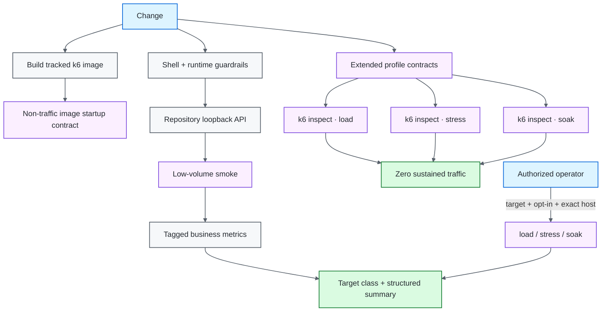

# k6 Performance Quality Engineering Framework

[](https://github.com/portyu9/qa-automation-load-k6/actions/workflows/ci.yml)
[](https://github.com/portyu9/qa-automation-load-k6/actions/workflows/extended.yml)
[](https://github.com/portyu9/qa-automation-load-k6/actions/workflows/security.yml)
[](https://github.com/portyu9/qa-automation-load-k6/actions/workflows/docs.yml)

[](https://k6.io/)
[](https://grafana.com/docs/k6/latest/using-k6/javascript-api/)
[](https://www.gnu.org/software/bash/)
[](https://www.docker.com/)
[](https://github.com/features/actions)
[](https://trivy.dev/)
[](LICENSE)
[](.github/SECURITY.md)

A k6 performance quality-engineering framework for **smoke, load, stress, and soak** analysis with explicit workload models, centralized threshold policy, tagged business metrics, exact-host authorization, deterministic smoke execution, zero-traffic safety verification, target-class evidence, and machine-readable summaries.

> [!CAUTION]
> `load`, `stress`, and `soak` are controlled traffic experiments—not ordinary automated test cases. Authorization, target identity, demand shape, generator capacity, service thresholds, and evidence are separate concerns. Routine CI must never silently become sustained traffic.

**Read by intent:** [capabilities](#capability-map) · [safety model](#target-and-authorization-model) · [quick start](#quick-start) · [workload model](#workload-and-threshold-model) · [metrics](#client-business-metrics-and-execution-context) · [evidence](#evidence-and-interpretation) · [runtime image](#packaged-runtime-and-dependency-ownership) · [dependencies](#dependency-maintenance) · [triage](#failure-triage)

## Capability map

| Plane | Question | Traffic behavior | Evidence |
| --- | --- | --- | --- |
| Guardrails | Will unsafe/missing configuration be rejected? | **Zero traffic** | Shell contract + `k6 inspect` |
| Packaged-runtime safety | Does the project image start without generating traffic? | **Zero traffic** | Built image + `k6 version` contract |
| Smoke | Does request/check/metric/summary behavior work end to end? | Very low volume to repository loopback API | Structured summary |
| Extended profiles | Do load/stress/soak initialize under authorized config? | **Zero traffic — inspect only** | Per-profile inspect evidence |
| Business metrics | Do domain attempts/success/failure/duration remain observable and tagged? | Same scenario traffic | Custom k6 metrics + summary headline |
| Load | Can expected demand satisfy service objectives? | Explicit operator execution | k6 metrics + thresholds |
| Stress | Where does controlled degradation begin? | Explicit operator execution | k6 metrics + failure shape |
| Soak | Does stable demand expose cumulative degradation? | Explicit operator execution | Time-dependent metrics |
| Security | Source, repository, and packaged-runtime exposure | No target traffic | CodeQL + repository/image Trivy + Dependency Review when available |
| Documentation | README/workflow/governance consistency | No target traffic | Actions status |

## Architecture



## Engineering invariants

| Concern | Framework contract |
| --- | --- |
| Target ownership | `K6_BASE_URL` is always explicit; there is no public-service fallback. |
| Target classification | Validated loopback hosts are `local-fixture`; all other validated hosts are `explicit-target`. Classification is diagnostic and does not grant authorization. |
| Required smoke | CI uses repository-owned `127.0.0.1:4020`. |
| Sustained authorization | `K6_ALLOW_LOAD_TEST=true` **and** exact hostname membership in `K6_ALLOWED_HOSTS`. |
| Target URL | Absolute HTTP(S), valid hostname/port, no credentials, query, or fragment. |
| Defense in depth | Shell wrapper and k6 runtime independently enforce safety. |
| Wrapper privacy | Unvalidated raw targets are not echoed into routine output. |
| Traffic model | Arrival-rate executors describe requested demand independently of iteration duration. |
| Thresholds | Shared service-level policy is centralized; deviations are explicit. |
| Business observability | Attempts, success, failure, and business duration are custom metrics tagged with endpoint/scenario context. |
| Capacity | `dropped_iterations` is a generator/scheduling signal, not automatically a server failure. |
| Evidence | Native metrics plus business headline values and structured threshold-breach details remain authoritative. |
| Runtime source | `docker/Dockerfile` pins the k6 runtime; CI/extended build that file rather than duplicating image tags in workflow shell. |
| Image startup | Starting the project image without an explicit command runs `k6 version`, not a traffic scenario. |
| Container identity | The project image runs scenario content as non-root user `12345`. |

## Target and authorization model

Every traffic-capable invocation requires `K6_BASE_URL`. Sustained profiles additionally require:

```text
K6_BASE_URL=<explicit target>
AND
K6_ALLOW_LOAD_TEST=true
AND
target hostname ∈ K6_ALLOWED_HOSTS
```

The shell wrapper fails early for normal operator ergonomics. `requireLoadAuthorization()` repeats the policy inside the traffic-capable JavaScript so direct `k6 run` cannot bypass it.

`lib/config.js` also classifies the validated target:

- `local-fixture` — `127.0.0.1`, `localhost`, or `::1`;
- `explicit-target` — any other validated hostname.

That classification is written to run evidence so local framework smoke cannot be confused with an external environment experiment. It is **not** an authorization bypass: sustained profiles still require the explicit opt-in and exact allowed-host match.

> [!IMPORTANT]
> An allowlist and boolean flag reduce accidental targeting risk; they are not proof of organizational authorization. Change control, ownership, maintenance windows, data policy, and observability remain operational prerequisites.

## Repository map

```text
.
├── .github/
│   ├── scripts/
│   └── workflows/
├── docker/
├── docs/
├── lib/
├── scripts/
└── tests/
```

## Quick start

Start the deterministic fixture:

```bash
node scripts/local-api.js
```

Run low-volume smoke:

```bash
K6_BASE_URL=http://127.0.0.1:4020 \
K6_RUN_ID=local-smoke \
bash scripts/run_k6.sh smoke
```

Validate guardrails without scenario traffic:

```bash
bash scripts/test_guardrails.sh
python .github/scripts/validate_readme.py
```

Build and start the packaged runtime without traffic:

```bash
docker build -t qa-k6-runtime -f docker/Dockerfile .
docker run --rm qa-k6-runtime
```

Inspect a sustained profile without executing it:

```bash
K6_BASE_URL=https://example.invalid \
K6_ALLOW_LOAD_TEST=true \
K6_ALLOWED_HOSTS=example.invalid \
k6 inspect --include-system-env-vars tests/load.js
```

<details>
<summary><strong>Runtime configuration</strong></summary>

| Variable | Purpose | Default |
| --- | --- | --- |
| `K6_BASE_URL` | Explicit target | required |
| `K6_RUN_ID` | Run correlation | generated ID |
| `K6_P95_MS` | Default p95 budget | `500` |
| `K6_ERROR_RATE` | Max normal error/business-failure rate | `0.01` |
| `K6_THINK_TIME_SECONDS` | Iteration pacing | `1` |
| `K6_ALLOW_LOAD_TEST` | Sustained-profile opt-in | unset / disabled |
| `K6_ALLOWED_HOSTS` | Exact authorized hostnames | unset |
| `K6_SOAK_DURATION` | Soak duration | `10m` |
| `K6_SOAK_RATE` | Soak arrival rate | `5` |

</details>

## Deterministic smoke boundary

`scripts/local-api.js` provides `/health` and `/posts/1` on loopback. CI starts it with bounded readiness polling, then runs the project-built k6 image using host networking. This preserves real k6 HTTP/check/metric/summary behavior while removing DNS, TLS, public service uptime, public rate limits, and demo-data drift from required CI.

The local fixture proves **framework correctness**, not service capacity.

## Workload and threshold model

| Profile | Executor | Question |
| --- | --- | --- |
| `smoke` | `shared-iterations` | Is the execution path healthy at negligible volume? |
| `load` | `ramping-arrival-rate` | Can expected throughput satisfy normal budgets? |
| `stress` | `ramping-arrival-rate` | How does behavior degrade beyond the normal envelope? |
| `soak` | `constant-arrival-rate` | Does stable demand reveal time-dependent degradation? |

Keep these concepts separate:

- **rate/stage** → demand requested from the generator;
- **VU capacity** → ability to generate that schedule;
- **threshold** → pass/fail service objective;
- **check** → correctness observation;
- **business metric** → domain-level attempt/success/failure/duration signal;
- **dropped iterations** → generator scheduling/capacity shortfall.

Changing workload shape and loosening thresholds in the same opaque change destroys interpretability.

## Client, business metrics, and execution context

`lib/client.js` centralizes stable request behavior, run headers, endpoint tags, JSON/content checks, and business metric updates. Scenario files own workload behavior; they should not duplicate transport boilerplate or hide k6 behind a generic DSL.

Every `getJson()` attempt updates tagged custom metrics from `lib/metrics.js`:

| Metric | Type | Meaning |
| --- | --- | --- |
| `business_attempts` | Counter | Domain request attempts |
| `business_success` | Rate | Check-complete business success |
| `business_failures` | Rate | Business/check failure rate |
| `business_duration` | Trend | Domain operation duration with time semantics |

Endpoint/scenario tags make aggregate performance explainable without encoding high-cardinality IDs into metric names. Checks still remain visible as checks; custom business metrics do not replace native HTTP metrics.

`lib/thresholds.js` centralizes common threshold expressions. Profile-specific differences should be deliberate and reviewable. Business success/error budgets are service-policy signals, while `dropped_iterations` remains a generator scheduling/capacity signal.

## Evidence and interpretation

`handleSummary()` writes a compact stdout/text headline and `reports/summary.json`. The structured evidence includes:

- run ID, target host, and `targetClass`;
- request count, HTTP failure rate, p95, and check rate;
- business attempt count, business success rate, business failure rate, and business p95;
- explicit threshold-breach tuples;
- no broad native `metrics`, `rootGroup`, or runtime `state` objects by default; the retained JSON is an explicit allowlisted projection.

A p95 number has no meaning without workload context. Interpret latency together with achieved throughput, HTTP/business failures, checks, threshold breaches, and `dropped_iterations`. If the generator did not produce the intended schedule, the experiment answered a different question.

> [!WARNING]
> A summary is evidence, not a causal explanation. A threshold can tell you that an objective was violated; service telemetry, generator health, workload shape, and dependency behavior explain why.

## Packaged runtime and dependency ownership

`docker/Dockerfile` is the single tracked source for the pinned k6 runtime used by CI and extended profile contracts. The workflows build that Dockerfile instead of independently hard-coding `grafana/k6:<version>` in shell commands.

That matters for two reasons:

1. **Dependency ownership** — Dependabot's Docker ecosystem can propose runtime updates at the file that actually controls CI execution.
2. **Safety ownership** — the image's default command is `k6 version`, so starting it cannot silently run smoke/load/stress/soak. Traffic requires an explicit `run ...` command plus `K6_BASE_URL`; sustained traffic still requires the separate authorization contract.

CI builds the image and verifies its startup/runtime contract before using it for smoke. Extended jobs build the same image and use `inspect` only. A Dockerfile change therefore exercises both packaged-runtime safety and profile initialization.

## CI topology

- `ci.yml` — zero-traffic guardrails, packaged-runtime contract, low-volume local smoke, and a semantic non-zero summary-evidence gate.
- `extended.yml` — project-image `k6 inspect` contracts for load/stress/soak with **zero sustained traffic** and non-empty JSON evidence validation.
- `security.yml` — CodeQL source analysis, repository Trivy, built-image Trivy, and pull-request Dependency Review when GitHub Dependency graph is available.
- `docs.yml` — deterministic README/governance validation.

No workflow automatically runs sustained load/stress/soak traffic.

## Dependency maintenance

Dependabot maintains **Docker** and **GitHub Actions** dependencies.

- weekly Monday 09:00 America/New_York;
- grouped minor/patch updates for routine maintenance;
- major Docker/runtime updates remain standalone because k6/runtime behavior can change materially;
- the Dockerfile is the actual k6 runtime source consumed by CI/extended, avoiding version drift between manifest and workflow shell;
- Actions are reviewed as executable supply-chain dependencies;
- dependency PRs are evaluated by zero-traffic guardrails, packaged-image startup, local smoke, extended inspect, security, and docs workflows.

Dependabot does not replace digest pinning, non-root container policy, CodeQL, repository/image Trivy, Dependency Review, or workload authorization.

## Failure triage

| Signal | First interpretation |
| --- | --- |
| Missing/invalid `K6_BASE_URL` | Target ownership/configuration |
| Shell guardrail rejection | Operator safety policy |
| `k6 inspect` rejection | Runtime authorization/URL policy |
| Image build/startup failure | Packaged runtime/dependency contract |
| Fixture readiness failure | Repository smoke fixture lifecycle |
| Smoke check/HTTP failure | Request/framework correctness |
| Business success/failure mismatch | Domain-level operation/check semantics |
| Target-class mismatch | Evidence/configuration classification |
| Threshold breach | Service objective under achieved workload |
| `dropped_iterations` | Generator capacity/scheduling |
| Sustained target unavailable | Explicit environment/infrastructure |
| Security/docs | Independent repository governance |

## Explicit anti-patterns

- implicit/public demo targets;
- image startup that generates traffic by default;
- duplicated k6 image versions across Dockerfile/workflow shell;
- running sustained traffic from ordinary pull-request CI;
- treating `K6_ALLOW_LOAD_TEST=true` alone as authorization;
- substring/wildcard host authorization where exact ownership is required;
- treating target classification as authorization;
- hiding workload shape behind opaque helpers;
- interpreting p95 without achieved throughput/generator health;
- treating business metrics as replacements for native HTTP/check signals;
- treating dropped iterations as automatic server errors;
- loosening thresholds merely to make a run green.

## Design references

- [`docs/ARCHITECTURE.md`](docs/ARCHITECTURE.md) — target safety, workload, client, metric, and evidence boundaries.
- [`docs/TEST_STRATEGY.md`](docs/TEST_STRATEGY.md) — gate model, profile semantics, interpretation, and exit criteria.

A strong performance framework makes the experiment answerable: **what target was authorized and classified, what demand was requested, what demand was achieved, what the HTTP and business signals reported, what threshold mattered, whether the runtime itself was controlled, and whether the generator became the bottleneck**.
