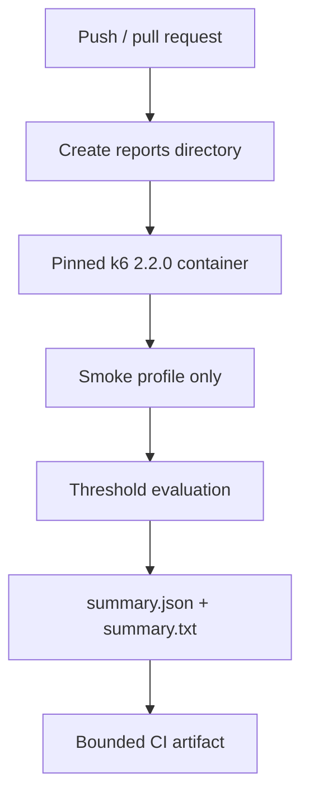

# k6 Performance Test Framework

A k6 framework for smoke, load, stress, and soak verification with explicit scenario models, service-level thresholds, custom business metrics, protected sustained-load execution, and machine-readable summaries. The default CI gate is intentionally low-impact; sustained profiles require explicit operator authorization **and** an exact target-host allowlist match.

## Engineering contract

| Concern | Framework policy |
| --- | --- |
| Default safety | CI runs only the low-volume smoke profile. |
| Sustained load | `load`, `stress`, and `soak` require `K6_ALLOW_LOAD_TEST=true` and the target hostname in `K6_ALLOWED_HOSTS`. |
| Scenario model | Arrival-rate executors model request demand independently from virtual-user iteration speed. |
| Thresholds | Shared SLO policy is generated by `lib/thresholds.js`; profile-specific tolerances are explicit. |
| Business failures | Custom metrics distinguish domain/check failures from transport metrics. |
| Diagnostics | Summary output includes run/target identity, headline metrics, full metrics, and explicit threshold breaches. |
| Correlation | `K6_RUN_ID` is propagated as request metadata for cross-system tracing. |
| Reproducibility | CI executes the pinned `grafana/k6:2.2.0` container image. |

## Architecture

```mermaid
flowchart LR
    OP[Operator / CI] --> PROFILE[smoke | load | stress | soak]
    PROFILE --> CFG[Validated config]
    PROFILE --> SLO[Central threshold policy]
    PROFILE --> CLIENT[HTTP client]
    CLIENT --> TARGET[Authorized target]
    CLIENT --> METRICS[HTTP + business metrics]
    METRICS --> SUMMARY[handleSummary]
    SLO --> SUMMARY
    SUMMARY --> JSON[reports/summary.json]
    SUMMARY --> TXT[reports/summary.txt]
```

The framework separates **traffic shape**, **request behavior**, **threshold policy**, **authorization**, and **reporting** so a change to one concern does not silently redefine another.

## Repository layout

```text
.
├── docker/
│   └── Dockerfile
├── lib/
│   ├── client.js
│   ├── config.js
│   ├── metrics.js
│   ├── summary.js
│   └── thresholds.js
├── scripts/
│   └── run_k6.sh
├── tests/
│   ├── smoke.js
│   ├── load.js
│   ├── stress.js
│   └── soak.js
├── docs/
│   ├── ARCHITECTURE.md
│   └── TEST_STRATEGY.md
└── .github/workflows/ci.yml
```

## Profile model

| Profile | Executor | Purpose | Default use |
| --- | --- | --- | --- |
| `smoke` | `shared-iterations` | Prove script correctness and basic target health at negligible volume. | Pull-request CI |
| `load` | `ramping-arrival-rate` | Verify expected operating demand against service budgets. | Controlled environment |
| `stress` | `ramping-arrival-rate` | Increase arrival demand beyond normal load to observe degradation boundaries. | Explicit performance exercise |
| `soak` | `constant-arrival-rate` | Hold stable demand long enough to expose cumulative degradation/leaks. | Dedicated environment/window |

Smoke testing answers **“does the scenario work?”**. Load/stress/soak answer capacity and reliability questions and must not be treated as interchangeable.

## Quick start

With a local k6 installation:

```bash
./scripts/run_k6.sh smoke
```

Or use the pinned Docker image:

```bash
mkdir -p reports

docker run --rm \
  -e K6_BASE_URL=https://jsonplaceholder.typicode.com \
  -e K6_RUN_ID=local-smoke \
  -v "$PWD:/src" \
  -w /src \
  grafana/k6:2.2.0 \
  run tests/smoke.js
```

The smoke profile does **not** require the sustained-load authorization variables because its traffic volume is intentionally minimal.

## Runtime configuration

| Variable | Purpose | Default |
| --- | --- | --- |
| `K6_BASE_URL` | Target base URL | `https://jsonplaceholder.typicode.com` |
| `K6_RUN_ID` | Cross-system run correlation | generated timestamp-based ID |
| `K6_P95_MS` | Default p95 response-time threshold | `500` |
| `K6_ERROR_RATE` | Maximum normal error/business-failure rate | `0.01` |
| `K6_THINK_TIME_SECONDS` | Iteration think-time pacing | `1` |
| `K6_ALLOW_LOAD_TEST` | Explicit sustained-load enable flag | unset / disabled |
| `K6_ALLOWED_HOSTS` | Comma-separated exact hostnames authorized for sustained profiles | unset |
| `K6_SOAK_DURATION` | Soak duration | `10m` |
| `K6_SOAK_RATE` | Soak arrival rate per second | `5` |

`K6_BASE_URL` must be an absolute HTTP(S) URL. Numeric thresholds must be positive, and error-rate values must be greater than zero and less than one.

## Sustained-load safety boundary

A boolean flag alone is too easy to inherit accidentally from a shell, CI environment, or copied command. Sustained profiles therefore require two independent conditions:

```text
K6_ALLOW_LOAD_TEST=true
AND
target hostname ∈ K6_ALLOWED_HOSTS
```

Example for an explicitly authorized environment:

```bash
export K6_BASE_URL=https://perf-api.example.internal
export K6_ALLOW_LOAD_TEST=true
export K6_ALLOWED_HOSTS=perf-api.example.internal
./scripts/run_k6.sh load
```

Multiple approved hosts can be comma-separated:

```bash
K6_ALLOWED_HOSTS=perf-a.example.internal,perf-b.example.internal
```

The match is against the parsed target hostname, not a substring. Listing `example.internal` does not authorize `perf-api.example.internal` unless that exact hostname is present.

The shell launcher performs an early presence check, but the JavaScript configuration layer is the definitive enforcement point. Invoking `k6 run tests/load.js` directly therefore does not bypass the guardrail.

> The allowlist is a friction/safety control, not proof of legal or organizational authorization. Only run sustained performance tests against systems for which the operator has explicit authorization and an appropriate testing window.

## Scenario design

### Smoke

The smoke profile uses one virtual user and three shared iterations with a hard maximum duration. It retrieves one resource and verifies a semantic identifier in addition to the shared HTTP checks.

### Load

The load profile uses `ramping-arrival-rate` to model external request demand:

```text
2 req/s start
→ 5 req/s
→ 10 req/s
→ 0 req/s
```

Arrival-rate executors are useful when the requirement is expressed as throughput because request demand is not accidentally reduced when response latency increases.

### Stress

The stress profile increases arrival demand through 10/20/30 req/s stages and uses intentionally wider but still explicit thresholds. Its purpose is to characterize behavior outside the normal operating envelope, not to reuse the load SLO unchanged.

### Soak

The soak profile uses `constant-arrival-rate` for a configurable duration and rate. It is intended for sustained observations such as resource growth, connection exhaustion, queue accumulation, or degradation over time.

## HTTP and business metrics

`lib/client.js` applies common request metadata and semantic checks. The framework records both standard k6 metrics and custom business metrics from `lib/metrics.js`.

This distinction matters:

```text
Transport failure
└── http_req_failed

HTTP succeeds but response violates business contract
└── business_failures / checks
```

A service returning HTTP 200 with invalid JSON semantics should not be classified as transport health.

## Central threshold policy

`lib/thresholds.js` builds shared threshold maps so every profile uses the same metric names and policy structure while retaining explicit tolerances.

Normal load/soak thresholds include:

- check success rate;
- HTTP failure rate;
- p95 response duration;
- dropped iteration count;
- business-failure rate.

Stress widens the check/error/latency budgets intentionally and omits dropped-iteration gating where saturation is part of the experiment. Smoke omits business/dropped-iteration thresholds that add little signal at three iterations.

Threshold changes should be reviewed as **service-level policy changes**, not cosmetic test edits.

## Structured summary

`handleSummary()` writes:

```text
reports/
├── summary.json
└── summary.txt
```

The JSON summary contains:

- schema version;
- run ID;
- target hostname;
- request count;
- HTTP failure rate;
- p95 response time;
- check pass rate;
- explicit threshold-breach entries;
- k6 state/root-group data;
- full metric payload.

The text summary is a compact one-line operational headline suitable for CI logs or human scanning.

A threshold failure is reported by both the k6 process exit status and the structured breach list. Do not parse console prose to determine pass/fail when machine-readable data is available.

## CI topology



CI deliberately does not set `K6_ALLOW_LOAD_TEST` or `K6_ALLOWED_HOSTS`; therefore a pull request cannot accidentally run the sustained profiles through the normal workflow.

## Failure triage

Classify performance failures by signal rather than immediately changing thresholds:

| Signal | Interpretation to investigate |
| --- | --- |
| `http_req_failed` breach | Transport/status reliability problem |
| `business_failures` breach | Response semantics failed despite transport completion |
| `checks` breach | One or more scripted behavioral checks are failing |
| p95 duration breach | Tail latency exceeds the declared budget |
| `dropped_iterations` breach | k6 could not start demanded iterations at the configured arrival rate/capacity |
| Authorization/allowlist error | Operator/target guardrail, not performance behavior |
| Smoke failure | Script/target correctness problem; do not proceed to higher load |

A threshold should be changed only when the accepted service objective changes or the profile is intentionally redesigned—not because a run failed.

## Capacity interpretation

Arrival-rate scenarios distinguish **demand** from **concurrency**:

- target rate describes requested iteration starts per time unit;
- preallocated VUs provide capacity to satisfy that rate;
- `maxVUs` limits dynamic growth;
- dropped iterations indicate that the configured VU capacity could not sustain the arrival model.

If dropped iterations rise, determine whether the target slowed, the generator lacked capacity, or `maxVUs` is intentionally constraining the experiment before drawing application-capacity conclusions.

## Extension rules

When adding a performance profile:

1. define the performance question first;
2. choose the executor that models that question;
3. keep the target authorization boundary for any non-smoke traffic;
4. use shared request/client behavior rather than duplicating correlation/check logic;
5. use `sloThresholds()` for common metric policy and make deviations explicit;
6. tag scenarios/endpoints so metrics remain attributable;
7. preserve a machine-readable summary and nonzero threshold failure exit;
8. document expected traffic volume and environment assumptions.

When adding endpoints:

- use stable endpoint tags rather than high-cardinality dynamic URLs as metric dimensions;
- keep semantic checks close to response handling;
- avoid placing secrets in tags, run IDs, or summary output;
- distinguish expected negative-test statuses from transport failure semantics.

## Anti-patterns

The framework intentionally avoids:

- running sustained load against arbitrary/public targets;
- relying on `K6_ALLOW_LOAD_TEST=true` without target identity validation;
- closed-model VU counts when the requirement is explicitly expressed as request arrival rate;
- duplicating threshold maps across every profile;
- raising thresholds until a failing run turns green;
- unbounded high-cardinality metric tags;
- using average response time as the primary latency objective;
- treating HTTP success as proof of business correctness;
- hiding threshold failures behind shell exit-code suppression.

## Further design documentation

- [`docs/ARCHITECTURE.md`](docs/ARCHITECTURE.md) — scenario, client, metric, reporting, and safety boundaries.
- [`docs/TEST_STRATEGY.md`](docs/TEST_STRATEGY.md) — profile selection, threshold governance, load authorization, and interpretation guidance.

The framework is designed so a performance result can be interpreted in terms of **traffic demand**, **generator capacity**, **transport reliability**, **business correctness**, **latency SLOs**, and **target authorization** rather than as a single undifferentiated pass/fail number.
