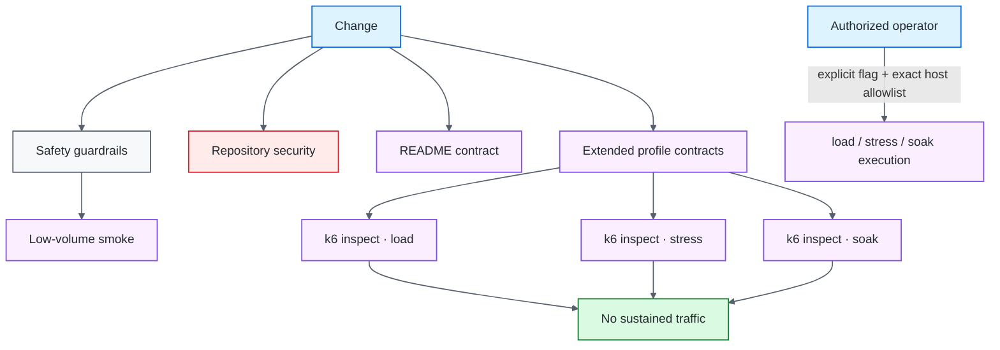
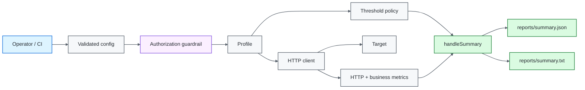
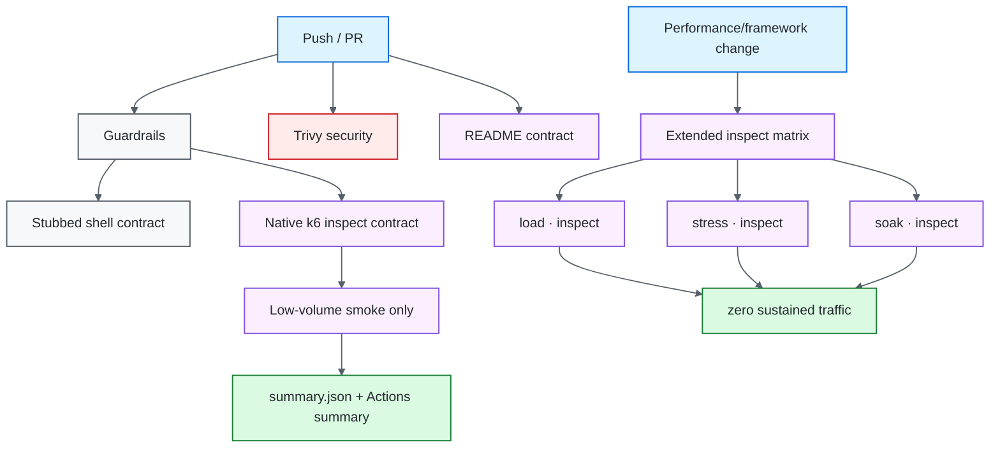

# k6 Performance Quality Engineering Framework

[](https://github.com/portyu9/qa-automation-load-k6/actions/workflows/ci.yml)
[](https://github.com/portyu9/qa-automation-load-k6/actions/workflows/extended.yml)
[](https://github.com/portyu9/qa-automation-load-k6/actions/workflows/security.yml)
[](https://github.com/portyu9/qa-automation-load-k6/actions/workflows/docs.yml)

[](https://k6.io/)
[](https://grafana.com/docs/k6/latest/using-k6/javascript-api/)
[](https://www.gnu.org/software/bash/)
[](https://www.docker.com/)
[](https://github.com/features/actions)
[](https://trivy.dev/)
[](LICENSE)
[](.github/SECURITY.md)

A k6 performance quality-engineering framework for smoke, load, stress, and soak analysis with explicit workload models, centralized threshold policy, business metrics, exact-host target guardrails, zero-traffic safety verification, and machine-readable summaries. Ordinary CI executes only guardrail validation and a deliberately low-volume smoke profile. Sustained profiles require explicit operator intent and an exact target-host allowlist match.

> [!CAUTION]
> `load`, `stress`, and `soak` are controlled traffic experiments, not ordinary automated test cases. Authorization, target identity, demand shape, generator capacity, service thresholds, and evidence are separate concerns; no routine CI path is allowed to silently become sustained traffic.

## Capability map

| Plane | Question | Traffic behavior | Evidence |
| --- | --- | --- | --- |
| Guardrails | Can unsafe/missing sustained-load configuration be rejected? | **Zero traffic** | Shell contract + `k6 inspect` |
| Smoke | Does the script/target path work and satisfy basic budgets? | Very low volume | `summary.json`, `summary.txt` |
| Extended profiles | Do `load`/`stress`/`soak` initialize under authorized config? | **Zero traffic — inspect only** | Per-profile inspect artifacts + summary |
| Sustained load | Does expected demand satisfy service objectives? | Explicit operator execution only | k6 metrics + thresholds |
| Stress | Where does controlled degradation begin? | Explicit operator execution only | k6 metrics + threshold interpretation |
| Soak | Does stable demand expose cumulative degradation? | Explicit operator execution only | k6 metrics over time |
| Security | Dependency/configuration exposure in repository assets | No target traffic | Trivy JSON + Markdown summary |
| Documentation contract | README links, workflow badges, Mermaid declarations, governance surfaces, badge palette | **Zero traffic** | Actions status |
| Observability | What did the smoke run measure and breach? | Native k6 summary | Actions summary + structured JSON |



## Engineering invariants

| Concern | Framework contract |
| --- | --- |
| Default safety | Automated CI validates guardrails first and runs smoke only. |
| Sustained authorization | `K6_ALLOW_LOAD_TEST=true` **and** exact hostname membership in `K6_ALLOWED_HOSTS`. |
| Target URL | Absolute HTTP(S), valid hostname/port, no credentials, query, or fragment. |
| Wrapper privacy | `run_k6.sh` never echoes raw `K6_BASE_URL` before JavaScript/k6 validation; unvalidated credential/query material cannot be copied into routine wrapper output. |
| Traffic model | Arrival-rate executors model requested demand independently from iteration duration. |
| Thresholds | Shared policy is generated centrally; profile deviations are explicit. |
| Business correctness | Domain failures are measured separately from HTTP transport failures. |
| Capacity | Dropped iterations are interpreted as a generator/scheduling signal, not automatically as service failure. |
| Diagnostics | Native structured summaries identify run/target, headline metrics, and threshold breaches. |
| Reproducibility | CI uses pinned `grafana/k6:2.2.0`; project container runs non-root. |
| Documentation | README-local references, workflow badges, Mermaid roots, governance files, and static badge-color uniqueness are executable contracts. |

## Tool ownership model

| Tool / technology | Native responsibility | Framework responsibility | Deliberately left visible |
| --- | --- | --- | --- |
| k6 | VU scheduling, executors, HTTP metrics, checks, thresholds, `inspect`, `handleSummary` | Profile design, shared config/threshold policy, target authorization, business metrics, structured evidence | Native metrics/threshold evaluation and executor behavior remain authoritative |
| JavaScript k6 runtime | Module initialization, environment access, URL parsing and test logic | Definitive target validation and `requireLoadAuthorization()` so direct `k6 run` cannot bypass guardrails | Validation happens where traffic-capable code actually executes |
| Bash wrapper | Operator ergonomics, profile dispatch, early shell checks | Fail early on missing sustained opt-in/allowlist, choose profile, invoke k6 | Wrapper is not the security boundary and does not log the unvalidated target |
| `k6 inspect` | Evaluate module/configuration initialization without executing the scenario | Zero-traffic CI proof that sustained profiles initialize only under authorized configuration | Inspect success does not prove performance capacity or target behavior |
| `shared-iterations` | Finite iteration scheduling | Low-volume smoke only | Smoke is health/correctness evidence, not load capacity |
| `ramping-arrival-rate` | Open-model requested arrival rate | Load/stress demand profiles with explicit VU bounds | `dropped_iterations` remains a generator/scheduling signal requiring diagnosis |
| `constant-arrival-rate` | Stable open-model arrival rate | Soak workload shape and duration policy | Soak interpretation requires time-dependent service/resource evidence |
| Docker | Reproducible k6 runtime/container execution | Pinned k6 image and non-root project image | Container/runtime problems remain infrastructure failures |
| Trivy | Filesystem vulnerability and supported misconfiguration analysis | HIGH/CRITICAL remediation-oriented repository gate | Configured `vuln,misconfig` scan is not generic credential/secret scanning or remote-target scanning |
| GitHub Actions | Job scheduling and artifact transport | Guardrail/smoke/extended/security/docs separation | No workflow automatically runs sustained load/stress/soak traffic |

## Architecture



The design separates **target safety**, **demand model**, **request semantics**, **generator capacity**, **service objectives**, and **reporting**. Those concepts should never be collapsed into one pass/fail interpretation.

## Repository map

```text
.
├── docker/Dockerfile
├── lib/
│   ├── client.js
│   ├── config.js
│   ├── metrics.js
│   ├── summary.js
│   └── thresholds.js
├── scripts/
│   ├── run_k6.sh
│   └── test_guardrails.sh
├── tests/
│   ├── smoke.js
│   ├── load.js
│   ├── stress.js
│   └── soak.js
├── docs/
│   ├── ARCHITECTURE.md
│   └── TEST_STRATEGY.md
└── .github/
    ├── scripts/
    │   └── validate_readme.py
    └── workflows/
        ├── ci.yml
        ├── docs.yml
        ├── extended.yml
        └── security.yml
```

## Documentation contract

`.github/workflows/docs.yml` validates deterministic repository-local documentation facts on every pull request and `main`: local Markdown targets, workflow badge targets, Mermaid declarations, canonical `LICENSE`/`.github/SECURITY.md`, unique static Shields colors, and the GitHub-dark `#24292F` Security Policy badge. It generates no target traffic and deliberately ignores external documentation-site uptime.

## Profile model

| Profile | Executor | Performance question | Automatic CI? |
| --- | --- | --- | --- |
| `smoke` | `shared-iterations` | Is the execution path healthy at negligible volume? | Yes |
| `load` | `ramping-arrival-rate` | Can normal operating demand satisfy declared budgets? | **No** |
| `stress` | `ramping-arrival-rate` | How does behavior degrade beyond the normal envelope? | **No** |
| `soak` | `constant-arrival-rate` | Does stable demand reveal time-dependent degradation? | **No** |

Smoke is a correctness/health signal. Load, stress, and soak are controlled experiments.

## Quick start

Low-volume smoke with local k6:

```bash
bash scripts/run_k6.sh smoke
```

Validate shell guardrails and README contracts without target traffic:

```bash
bash scripts/test_guardrails.sh
python .github/scripts/validate_readme.py
```

Pinned container smoke execution:

```bash
mkdir -p reports

docker run --rm \
  -e K6_BASE_URL=https://jsonplaceholder.typicode.com \
  -e K6_RUN_ID=local-smoke \
  -v "$PWD:/src" \
  -w /src \
  grafana/k6:2.2.0 \
  run tests/smoke.js
```

Inspect a sustained profile without executing it:

```bash
K6_BASE_URL=https://example.invalid \
K6_ALLOW_LOAD_TEST=true \
K6_ALLOWED_HOSTS=example.invalid \
k6 inspect --include-system-env-vars tests/load.js
```

> [!NOTE]
> `k6 inspect` evaluates module/configuration initialization. It does not execute the sustained scenario. The extended workflow uses this distinction deliberately.

## Runtime configuration

| Variable | Purpose | Default |
| --- | --- | --- |
| `K6_BASE_URL` | Target base URL | `https://jsonplaceholder.typicode.com` |
| `K6_RUN_ID` | Cross-system run correlation | generated ID |
| `K6_P95_MS` | Default p95 budget | `500` |
| `K6_ERROR_RATE` | Maximum normal error/business-failure rate | `0.01` |
| `K6_THINK_TIME_SECONDS` | Iteration pacing | `1` |
| `K6_ALLOW_LOAD_TEST` | Sustained-profile opt-in | unset / disabled |
| `K6_ALLOWED_HOSTS` | Exact authorized hostnames | unset |
| `K6_SOAK_DURATION` | Soak duration | `10m` |
| `K6_SOAK_RATE` | Soak arrival rate | `5` |

`K6_BASE_URL` must be an absolute HTTP(S) URL. Optional path prefixes are allowed. URL credentials, query strings, fragments, invalid hostnames, nonnumeric ports, and ports outside `1..65535` are rejected.

## Sustained-profile authorization boundary

A single boolean opt-in is insufficient because it can be inherited accidentally from a shell or copied CI environment. The framework requires both:

```text
K6_ALLOW_LOAD_TEST=true
AND
target hostname ∈ K6_ALLOWED_HOSTS
```

Example for an intentionally controlled performance environment:

```bash
export K6_BASE_URL=https://perf-api.example.internal
export K6_ALLOW_LOAD_TEST=true
export K6_ALLOWED_HOSTS=perf-api.example.internal
bash scripts/run_k6.sh load
```

Matching is exact. `example.internal` does not authorize `perf-api.example.internal`.

The shell wrapper performs early human-readable checks, while JavaScript `requireLoadAuthorization()` is the definitive enforcement boundary. Directly invoking `k6 run tests/load.js` therefore does not bypass authorization.

> [!WARNING]
> These controls prove framework intent and exact target identity, not legal or organizational authorization. Sustained execution still requires target ownership, an approved test window, change control, capacity planning, and operational coordination.

## Pre-validation output safety

`scripts/run_k6.sh` intentionally reports profile/run identity but prints `target=<validated-by-k6>` rather than interpolating the raw `K6_BASE_URL`. This matters because the shell executes **before** `lib/config.js` can reject URL credentials, query strings, or fragments.

`scripts/test_guardrails.sh` contains a regression using a credential/query-bearing synthetic target and asserts that neither the raw URL nor sensitive markers such as `password` or `access_token` appear in wrapper output. The JavaScript layer remains responsible for rejecting the target itself.

## Zero-traffic safety validation

Primary CI validates sustained-load safety before smoke.

### Shell contract

`scripts/test_guardrails.sh` replaces the `k6` executable with a stub and proves missing sustained-load opt-in is refused, missing allowlist is refused, a valid flag/allowlist combination reaches the expected command, and unvalidated target material is not printed. No target is contacted.

### Native k6 initialization contract

The pinned k6 image runs `inspect --include-system-env-vars` against the load profile to prove rejection of missing opt-in, host allowlist mismatch, URL credentials, and query-bearing target URLs. It also proves successful initialization for an exact allowlisted target—still without running the load scenario.

## Extended sustained-profile validation

`.github/workflows/extended.yml` expands zero-traffic coverage to **all sustained profiles**:

```text
matrix
├── load   → k6 inspect
├── stress → k6 inspect
└── soak   → k6 inspect
```

The matrix target is `https://example.invalid`, with the exact hostname allowlisted only for initialization. Each cell stores inspect output and a Markdown run summary.

> [!CAUTION]
> The extended workflow does **not** execute `k6 run` for load, stress, or soak. It does not generate sustained target traffic on pull requests, pushes, schedules, or manual workflow dispatch.

## Workload-model semantics

### Smoke — `shared-iterations`

One virtual user performs three shared iterations under a hard maximum duration. This validates request/script correctness at negligible volume; it does not estimate capacity.

### Load and stress — `ramping-arrival-rate`

Arrival-rate executors are an **open workload model**: the requested start rate is independent of how slowly prior iterations complete. This is appropriate when incoming demand is the independent variable. A slower target therefore does not silently lower the configured arrival rate.

Load models a normal demand envelope. Stress deliberately moves beyond it and uses explicit wider tolerances to characterize controlled degradation rather than pretending normal-load SLOs apply unchanged.

### Soak — `constant-arrival-rate`

Soak holds a stable open-model arrival rate long enough to expose resource growth, connection exhaustion, queue accumulation, periodic degradation, or other time-dependent effects.

## Transport, business, and generator signals

`lib/client.js` applies common request metadata and semantic checks. The framework distinguishes three different signal families:

```text
HTTP / transport failure
└── http_req_failed

HTTP completes but domain contract is wrong
└── business_failures + checks

Requested arrival could not be scheduled
└── dropped_iterations
```

An HTTP 200 with wrong semantics is not healthy. A dropped iteration is not automatically a service failure: it can arise from target slowdown, load-generator limits, or deliberately insufficient `maxVUs`.

## Threshold policy

`lib/thresholds.js` centralizes threshold construction so metric names and policy shape stay consistent. Normal load/soak policy covers check success, HTTP failure rate, p95 response duration, dropped iterations, and business-failure rate. Stress explicitly widens selected budgets. Smoke omits thresholds that provide little statistical signal at three iterations.

> [!IMPORTANT]
> Threshold edits are service-objective or experiment-design changes. They are not a mechanism for turning an undesirable run green.

## Arrival-rate capacity interpretation

For arrival-rate scenarios:

- **target rate** is requested iteration starts per unit time;
- `preAllocatedVUs` is initially provisioned generator capacity;
- `maxVUs` is the upper generator capacity bound;
- `dropped_iterations` counts requested starts the generator could not schedule.

A dropped-iteration breach requires diagnosis. Compare service latency, generator CPU/memory, active VUs and the configured VU ceiling before attributing it to the system under test.

## Structured observability

`handleSummary()` writes:

```text
reports/
├── summary.json
└── summary.txt
```

The JSON summary includes run/target identity, headline request count, HTTP failure rate, p95 latency, check rate, explicit threshold-breach entries, state/root-group context, and metric summaries. Primary CI publishes structured headline fields into the Actions summary rather than scraping console prose.

```text
K6_RUN_ID
├── outbound request correlation
├── k6 metrics
├── threshold breach identity
├── summary.json
└── Actions summary
```

These artifacts are vendor-neutral and can later feed open-source time-series/log pipelines without changing test logic.

## Security engineering

`.github/workflows/security.yml` runs open-source Trivy filesystem scanning with immutable action commit `ed142fd0673e97e23eac54620cfb913e5ce36c25` (`v0.36.0`) and Trivy `v0.74.0`.

The configured gate covers fixed HIGH/CRITICAL dependency vulnerabilities and HIGH/CRITICAL supported repository/configuration misconfigurations. It examines repository/container/configuration assets, not a remote performance target. Its configured scanners are `vuln,misconfig`; this repository does not claim generic credential/secret scanning.

Security findings and performance threshold failures are independent failure domains.

## CI topology



## Failure triage

| Signal | First interpretation | Correct first move |
| --- | --- | --- |
| Shell guardrail refusal | Operator/config authorization | Correct opt-in/allowlist; do not bypass wrapper checks |
| URL validation refusal | Target configuration | Remove unsafe URL components / correct hostname/port |
| Credential/query leak regression | Wrapper privacy boundary | Keep raw target out of pre-validation output |
| `k6 inspect` failure | Module/config/profile initialization | Fix configuration/script without running sustained traffic |
| Smoke HTTP/check failure | Basic target/request semantics | Inspect smoke summary and target health |
| Threshold breach | Service objective / experiment result | Diagnose metric and workload before changing threshold |
| Dropped iterations | Generator/scheduling capacity | Compare target latency, VU demand and generator resources |
| Extended matrix failure | Sustained-profile configuration | Fix profile init; extended does not prove target performance |
| README contract | Documentation/governance drift | Fix local target, workflow badge, Mermaid declaration, governance surface, or palette collision |
| Trivy failure | Dependency/configuration risk | Triage exact repository finding |

## Extension rules

1. validate any new target/environment input before traffic;
2. keep definitive sustained authorization inside JavaScript/k6 code, not only the shell wrapper;
3. never print an unvalidated raw target before URL safety checks;
4. choose executor semantics based on the performance question, not habit;
5. keep business correctness separate from transport success;
6. interpret dropped iterations as a generator/scheduling signal requiring context;
7. centralize shared threshold policy and make profile deviations explicit;
8. preserve smoke as the only automatic traffic-bearing CI profile;
9. keep extended sustained validation inspect-only;
10. keep structured evidence native to k6 metrics/thresholds;
11. keep Docker/runtime behavior reproducible and non-root where practical;
12. update README contracts whenever profile, guardrail, workflow, or evidence behavior changes.

## Explicit anti-patterns

- automatic `k6 run` of load/stress/soak on routine CI events;
- wildcard/suffix host authorization where exact identity is required;
- one boolean opt-in as the only sustained-load control;
- raw `K6_BASE_URL` echoed before validation;
- credentials/query secrets embedded in target URLs;
- closed-model VU counts used when the requirement is a fixed arrival rate without acknowledging the semantic difference;
- `dropped_iterations` automatically blamed on the service;
- threshold loosening used as failure remediation;
- smoke results presented as capacity evidence;
- business semantic failures hidden inside aggregate HTTP success;
- README claims or badge surfaces not backed by committed repository state.

## Design references

- [`docs/ARCHITECTURE.md`](docs/ARCHITECTURE.md) — authorization, workload, metrics, threshold, and evidence boundaries.
- [`docs/TEST_STRATEGY.md`](docs/TEST_STRATEGY.md) — performance questions, profile selection, guardrails, and interpretation.

> [!TIP]
> Mature performance engineering separates **what demand was requested**, **whether the generator could schedule it**, **what the service did**, and **whether the business response was correct**. k6 provides those primitives; the framework's job is to keep their ownership and safety boundaries explicit.
