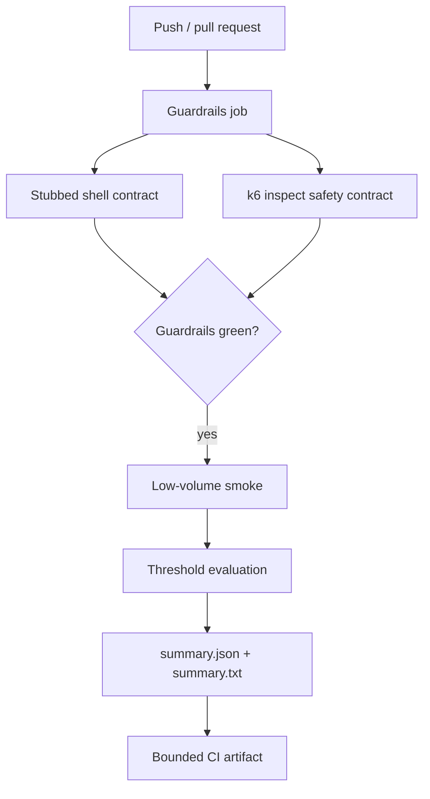

# k6 Performance Test Framework

A k6 framework for smoke, load, stress, and soak verification with explicit scenario models, centralized service thresholds, custom business metrics, defense-in-depth target controls, zero-traffic safety verification, and machine-readable summaries. Ordinary CI runs only guardrail validation plus a deliberately low-volume smoke profile; sustained profiles require explicit operator intent **and** an exact target-host allowlist match.

## Engineering contract

| Concern | Framework policy |
| --- | --- |
| Default safety | CI proves guardrails without scenario traffic, then runs only the low-volume smoke profile. |
| Sustained load | `load`, `stress`, and `soak` require `K6_ALLOW_LOAD_TEST=true` and the exact target hostname in `K6_ALLOWED_HOSTS`. |
| Target URL | Absolute HTTP(S), no URL credentials/query/fragment, valid hostname and port 1–65535. |
| Scenario model | Arrival-rate executors model request demand independently from virtual-user iteration speed. |
| Thresholds | Shared SLO policy is generated by `lib/thresholds.js`; profile-specific tolerances are explicit. |
| Business failures | Custom metrics distinguish domain/check failures from transport metrics. |
| Diagnostics | Summary output includes run/target identity, headline metrics, full metrics, and explicit threshold breaches. |
| Correlation | `K6_RUN_ID` is propagated as request metadata for cross-system tracing. |
| Reproducibility | CI executes the pinned `grafana/k6:2.2.0` container image. |

## Architecture

```mermaid
flowchart LR
    OP[Operator / CI] --> CFG[Validated target/config]
    CFG --> AUTH[Authorization guardrail]
    AUTH --> PROFILE[smoke | load | stress | soak]
    PROFILE --> SLO[Central threshold policy]
    PROFILE --> CLIENT[HTTP client]
    CLIENT --> TARGET[Target service]
    CLIENT --> METRICS[HTTP + business metrics]
    METRICS --> SUMMARY[handleSummary]
    SLO --> SUMMARY
    SUMMARY --> JSON[reports/summary.json]
    SUMMARY --> TXT[reports/summary.txt]
```

The framework separates **target safety**, **traffic shape**, **request behavior**, **threshold policy**, **generator capacity**, and **reporting** so a change to one concern does not silently redefine another.

## Repository layout

```text
.
├── docker/
│   └── Dockerfile
├── lib/
│   ├── client.js
│   ├── config.js
│   ├── metrics.js
│   ├── summary.js
│   └── thresholds.js
├── scripts/
│   ├── run_k6.sh
│   └── test_guardrails.sh
├── tests/
│   ├── smoke.js
│   ├── load.js
│   ├── stress.js
│   └── soak.js
├── docs/
│   ├── ARCHITECTURE.md
│   └── TEST_STRATEGY.md
└── .github/workflows/ci.yml
```

## Profile model

| Profile | Executor | Purpose | Default use |
| --- | --- | --- | --- |
| `smoke` | `shared-iterations` | Prove script correctness and basic target health at negligible volume. | Pull-request CI |
| `load` | `ramping-arrival-rate` | Verify expected operating demand against service budgets. | Controlled environment |
| `stress` | `ramping-arrival-rate` | Increase arrival demand beyond normal load to observe degradation boundaries. | Explicit performance exercise |
| `soak` | `constant-arrival-rate` | Hold stable demand long enough to expose cumulative degradation/leaks. | Dedicated environment/window |

Smoke answers **“does the execution path work?”**. Load/stress/soak answer capacity/reliability questions and must not be treated as interchangeable.

## Quick start

With a local k6 installation:

```bash
bash scripts/run_k6.sh smoke
```

Or use the pinned Docker image:

```bash
mkdir -p reports

docker run --rm \
  -e K6_BASE_URL=https://jsonplaceholder.typicode.com \
  -e K6_RUN_ID=local-smoke \
  -v "$PWD:/src" \
  -w /src \
  grafana/k6:2.2.0 \
  run tests/smoke.js
```

The smoke profile does **not** require sustained-load authorization variables because its traffic is intentionally minimal.

Validate the shell guardrail without real k6 traffic:

```bash
bash scripts/test_guardrails.sh
```

The self-test injects a stub `k6` executable and proves the wrapper's refusal/forwarding behavior without contacting a target.

## Runtime configuration

| Variable | Purpose | Default |
| --- | --- | --- |
| `K6_BASE_URL` | Target base URL | `https://jsonplaceholder.typicode.com` |
| `K6_RUN_ID` | Cross-system run correlation | generated timestamp-based ID |
| `K6_P95_MS` | Default p95 response-time threshold | `500` |
| `K6_ERROR_RATE` | Maximum normal error/business-failure rate | `0.01` |
| `K6_THINK_TIME_SECONDS` | Iteration think-time pacing | `1` |
| `K6_ALLOW_LOAD_TEST` | Explicit sustained-load enable flag | unset / disabled |
| `K6_ALLOWED_HOSTS` | Comma-separated exact hostnames permitted by the framework guardrail | unset |
| `K6_SOAK_DURATION` | Soak duration | `10m` |
| `K6_SOAK_RATE` | Soak arrival rate per second | `5` |

`K6_BASE_URL` must be an absolute HTTP(S) URL. It may contain a path prefix, but it must not contain URL credentials, a query string, or a fragment. If a port is supplied it must be numeric and between 1 and 65535. Numeric thresholds must be positive; error-rate values must be greater than zero and less than one.

## Sustained-profile safety boundary

A boolean flag alone is too easy to inherit accidentally from a shell or copied CI environment. Sustained profiles therefore require two independent conditions:

```text
K6_ALLOW_LOAD_TEST=true
AND
target hostname ∈ K6_ALLOWED_HOSTS
```

Example for an explicitly controlled environment:

```bash
export K6_BASE_URL=https://perf-api.example.internal
export K6_ALLOW_LOAD_TEST=true
export K6_ALLOWED_HOSTS=perf-api.example.internal
bash scripts/run_k6.sh load
```

Multiple approved hostnames can be comma-separated:

```bash
K6_ALLOWED_HOSTS=perf-a.example.internal,perf-b.example.internal
```

The comparison is exact against the parsed hostname. Listing `example.internal` does not match `perf-api.example.internal`.

The shell launcher performs early human-readable checks, but `requireLoadAuthorization()` in the JavaScript scenario is the definitive framework enforcement point. Calling `k6 run tests/load.js` directly therefore does not bypass the guardrail.

> These variables are friction/intent controls, not proof of legal or organizational authorization. Sustained performance execution still requires target ownership, an approved testing window, and appropriate operational change control.

## Safety verification in CI

The workflow has a `guardrails` job **before** smoke. It performs two zero-traffic validations.

First, `scripts/test_guardrails.sh` stubs the `k6` binary and proves:

- `load` refuses execution without `K6_ALLOW_LOAD_TEST=true`;
- `load` refuses execution without `K6_ALLOWED_HOSTS`;
- a valid flag/allowlist combination reaches the expected k6 command.

Second, the pinned k6 container uses `k6 inspect tests/load.js`. Module initialization must reject:

- missing opt-in;
- allowlist mismatch;
- URL credentials;
- a query-bearing target URL.

The same load module must inspect successfully when the exact configured host is allowlisted. `k6 inspect` evaluates configuration/module initialization without running the traffic scenario, so the safety contract is tested without sending sustained load.

Only after the guardrail job passes does the smoke job execute.

## Scenario design

### Smoke

Smoke uses one virtual user and three shared iterations with a hard maximum duration. It retrieves one resource and verifies a semantic identifier in addition to shared HTTP checks.

### Load

Load uses `ramping-arrival-rate` to model external request demand:

```text
2 req/s start
→ 5 req/s
→ 10 req/s
→ 0 req/s
```

Arrival-rate executors are appropriate when the requirement is throughput because requested demand is not silently reduced when response latency grows.

### Stress

Stress increases arrival demand through 10/20/30 req/s stages and uses wider but still explicit tolerances. Its purpose is to characterize behavior beyond the normal operating envelope, not to reuse the normal-load SLO unchanged.

### Soak

Soak uses `constant-arrival-rate` for a configurable duration/rate to expose time-dependent behavior such as resource growth, connection exhaustion, queue accumulation, or periodic degradation.

## HTTP and business metrics

`lib/client.js` applies common request metadata and semantic checks. The framework records standard k6 metrics plus custom business metrics from `lib/metrics.js`.

```text
Transport/status failure
└── http_req_failed

HTTP completes but response violates domain contract
└── business_failures / checks
```

A service returning HTTP 200 with invalid semantics should not be classified as healthy merely because the transport succeeded.

## Central threshold policy

`lib/thresholds.js` builds shared threshold maps so profiles use consistent metric names/policy structure while retaining intentional tolerances.

Normal load/soak policy includes:

- check success rate;
- HTTP failure rate;
- p95 response duration;
- dropped iteration count;
- business-failure rate.

Stress deliberately widens selected budgets. Smoke omits business/dropped-iteration thresholds that add little signal at three iterations.

Threshold changes are **service-level policy changes**, not cosmetic test edits.

## Arrival-rate capacity interpretation

Arrival-rate scenarios distinguish demand from generator capacity:

- target rate = requested iteration starts per time unit;
- `preAllocatedVUs` = initially available generator capacity;
- `maxVUs` = upper bound for dynamic capacity;
- `dropped_iterations` = requested iterations that could not be started on schedule.

If dropped iterations grow, determine whether the system slowed, the generator lacked capacity, or `maxVUs` intentionally constrained the experiment before drawing service-capacity conclusions.

## Structured summary

`handleSummary()` writes:

```text
reports/
├── summary.json
└── summary.txt
```

The JSON summary contains schema/run/target identity, request count, HTTP failure rate, p95 latency, check rate, explicit threshold-breach entries, k6 state/root group, and the metric summaries. The text file is a compact operational headline.

Threshold failure is represented by k6's process status and the structured breach list. Do not parse console prose when machine-readable data is available.

## CI topology



The normal workflow never executes `load`, `stress`, or `soak`. It sets sustained-load variables only inside zero-traffic `inspect` checks used to prove that the authorization logic accepts/rejects the intended configurations.

## Failure triage

| Signal | Interpretation to investigate |
| --- | --- |
| Shell/inspect guardrail failure | Safety/configuration regression; do not proceed to traffic |
| `http_req_failed` breach | Transport/status reliability problem |
| `business_failures` breach | Response semantics failed despite transport completion |
| `checks` breach | One or more scripted behavioral checks are failing |
| p95 duration breach | Tail latency exceeds the declared budget |
| `dropped_iterations` breach | Generator could not sustain requested arrival schedule/capacity |
| Authorization/allowlist error | Target/intent guardrail, not performance behavior |
| Smoke failure | Script/target correctness problem; do not proceed to sustained profiles |

A threshold should change only when the accepted objective changes or the experiment is intentionally redesigned—not because one run failed.

## Extension rules

When adding a profile:

1. define the performance question first;
2. choose the executor that models that question;
3. preserve sustained-profile target authorization;
4. use shared request/client behavior rather than duplicating correlation/check logic;
5. use central threshold policy and make deviations explicit;
6. tag scenarios/endpoints with bounded stable dimensions;
7. preserve machine-readable summaries and nonzero threshold failures;
8. document expected traffic and environment assumptions;
9. add zero-traffic validation if the change modifies a safety boundary.

## Anti-patterns

The framework intentionally avoids:

- sustained traffic against arbitrary/uncontrolled targets;
- relying on the enable flag without exact target identity validation;
- credentials/query secrets embedded in the target URL;
- duplicating threshold maps across profiles;
- raising thresholds until a failed run becomes green;
- unbounded high-cardinality metric tags;
- average response time as the primary latency objective;
- treating HTTP success as proof of business correctness;
- suppressing threshold/process failures in shell code;
- mixing safety validation and real sustained traffic in ordinary PR CI.

## Further design documentation

- [`docs/ARCHITECTURE.md`](docs/ARCHITECTURE.md) — target, scenario, metric, threshold, reporting, and safety boundaries.
- [`docs/TEST_STRATEGY.md`](docs/TEST_STRATEGY.md) — zero-traffic guardrail tests, profile selection, threshold governance, and interpretation.

The framework is designed so a result can be interpreted in terms of **target safety**, **traffic demand**, **generator capacity**, **transport reliability**, **business correctness**, and **latency thresholds** rather than as one undifferentiated pass/fail number.
