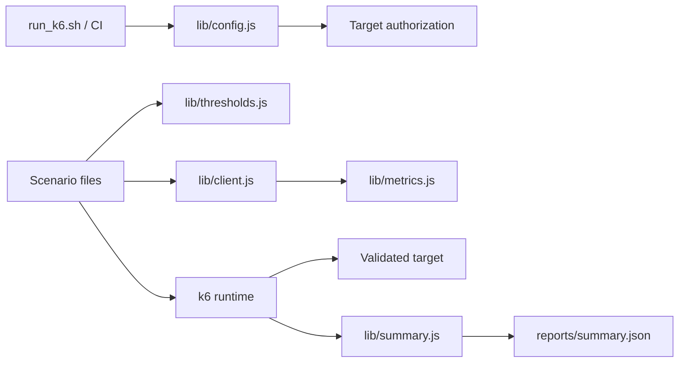

# Architecture

## Design objective

The k6 framework separates **traffic shape**, **business/request helpers**, **quality thresholds**, **target authorization**, and **evidence** so changing one concern does not silently redefine the others.

Traffic generation remains native k6. Shared modules centralize policy but do not create a second load-test DSL.

## Target configuration

`K6_BASE_URL` is validated during module initialization. It must:

- be an absolute HTTP(S) URL;
- contain no URL user-info/credentials;
- contain no query string or fragment;
- contain a syntactically valid hostname;
- use a numeric port in the range 1–65535 when a port is present;
- preserve optional path prefixes.

The parsed target hostname is normalized and used for exact allowlist comparison.

## Defense-in-depth authorization

Smoke is deliberately low-volume and does not require the sustained-load opt-in. `load`, `stress`, and `soak` are disabled unless **both** conditions hold:

1. `K6_ALLOW_LOAD_TEST=true`;
2. the exact parsed target hostname appears in `K6_ALLOWED_HOSTS`.

This policy exists twice on purpose:

- `scripts/run_k6.sh` provides an early human-readable refusal for normal local use;
- `requireLoadAuthorization()` in scenario code enforces the rule even when an operator bypasses the shell wrapper and invokes `k6 run` directly.

The environment flag is only a friction/intent guardrail. It is not proof of legal/operational authorization; target ownership and change-control remain external responsibilities.

## CI safety verification

CI has a dedicated `guardrails` job before smoke execution.

The shell contract uses a stub `k6` binary, so refusal behavior is tested with zero network traffic. CI also invokes `k6 inspect` against the load scenario to prove JavaScript initialization rejects:

- missing sustained-load opt-in;
- a target hostname absent from the allowlist;
- URL credentials;
- query-bearing base URLs.

A matching allowlisted target must inspect successfully. Only after this guardrail job passes does the normal smoke job execute.

`k6 inspect` evaluates scenario/options/module initialization without executing the configured traffic scenario, making it suitable for safety-policy verification.

## Scenario model

Scenario files own workload shape:

- smoke → tiny shared-iteration correctness signal;
- load → ramping arrival rate around an expected service region;
- stress → increasing arrival rates beyond normal operating expectations;
- soak → sustained constant arrival rate for time-dependent degradation.

Arrival-rate executors describe requested throughput independently from virtual-user iteration speed. `preAllocatedVUs`/`maxVUs` are capacity to generate the requested schedule, not the performance objective itself.

## Request/client boundary

`lib/client.js` centralizes repeated HTTP behavior, request/run headers, endpoint tags, JSON/content-type checks, and custom metric updates. Scenario files should express user/traffic behavior rather than duplicate protocol boilerplate.

Do not hide k6's HTTP API behind a large generic abstraction. Shared client helpers should represent stable service operations or common measurement policy.

## Metrics and thresholds

Built-in request/check metrics are augmented by named custom business metrics. Endpoint/scenario tags allow threshold/filter analysis without duplicating metric definitions.

`lib/thresholds.js` is the single source for common threshold expressions. Profiles can supply deliberate overrides, but a threshold change should be visibly separated from traffic-shape changes.

Important distinctions:

- a threshold is a pass/fail SLO/assertion;
- a stage/rate defines generated traffic;
- VU capacity determines whether k6 can sustain that arrival schedule;
- `dropped_iterations` indicates generator capacity/scheduling shortfall and must not be confused with server request failure.

## Summary evidence

`handleSummary()` emits a compact stdout line and `reports/summary.json`. The JSON includes key request/error/check/latency values, raw metric summaries, and explicit threshold-breach details.

Threshold failures should be interpreted together with achieved request volume and dropped iterations. A p95 breach at a materially different achieved throughput than intended answers a different question from a p95 breach at the planned rate.

## Extension rules

New performance behavior should:

1. preserve the target validation/authorization boundary;
2. keep ordinary CI limited to low-volume smoke plus zero-traffic guardrail validation;
3. choose an executor that matches the performance question;
4. keep threshold policy centralized and reviewable;
5. add endpoint/scenario tags before inventing duplicate metrics;
6. distinguish generator saturation (`dropped_iterations`) from service failures;
7. write machine-readable summary evidence;
8. require explicit environment ownership/change control for sustained profiles.
