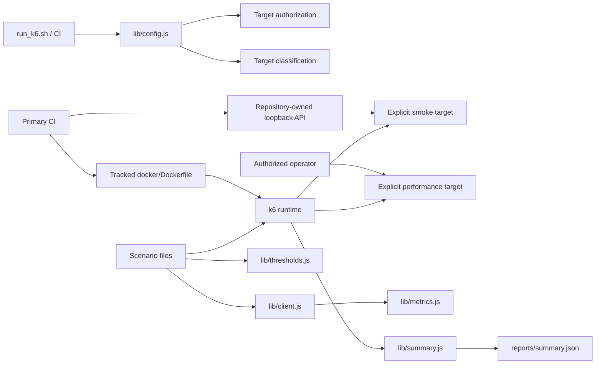

# Architecture

## Design objective

The k6 framework separates **target ownership**, **traffic shape**, **business/request helpers**, **quality thresholds**, **authorization**, **fixture lifecycle**, **packaged runtime**, and **evidence** so changing one concern does not silently redefine the others.

Traffic generation remains native k6. Shared modules centralize policy but do not create a second load-test DSL. Required CI never depends on a public demonstration service.

## Explicit target and correlation configuration

`K6_BASE_URL` is required for every traffic-capable invocation and is validated during module initialization. There is no public-service fallback.

The value must:

- be present and nonblank;
- be an absolute HTTP(S) URL;
- contain no URL user-info/credentials;
- contain no query string or fragment;
- contain a syntactically valid hostname;
- use a numeric port in the range 1–65535 when a port is present;
- preserve optional path prefixes.

The parsed target hostname is normalized and used for exact sustained-load allowlist comparison. Missing target ownership is a configuration error before k6 can execute traffic.

`K6_RUN_ID` is a bounded correlation token, not free-form text. Supplied values are trimmed and must contain only 1–128 ASCII letters, digits, dots, underscores, colons, or hyphens. This protects HTTP header semantics and retained run evidence from whitespace/control-character injection or unbounded cardinality.

`scripts/run_k6.sh` independently refuses an unset `K6_BASE_URL` before invoking k6. This shell check improves operator feedback; `lib/config.js` remains the definitive target/correlation validation boundary for direct `k6 run` execution.

## Target classification

`lib/config.js` records a structural `targetClass` alongside the validated hostname:

- `local-fixture` for loopback fixture hosts (`127.0.0.1`, `localhost`, `::1`);
- `explicit-target` for every other validated host.

Classification is evidence, not authorization. An `explicit-target` still requires sustained-load opt-in and exact allowlisting for load/stress/soak. A local classification does not imply permission for arbitrary traffic either; it identifies only the target type used in summaries.

## Repository-owned smoke fixture

`scripts/local-api.js` is the deterministic HTTP dependency for required smoke CI. It uses only Node.js built-ins and binds to `127.0.0.1` on port `4020` by default.

The fixture exposes only the behavior needed by the smoke contract:

- `GET /health` for bounded readiness detection;
- `GET /posts/1` for the k6 request/content/metric path;
- a deterministic JSON 404 envelope for all other routes.

The fixture does not emulate a production provider and is not capacity evidence. Its role is to prove k6 script initialization, real HTTP transport, JSON/content checks, metrics, thresholds, and summary generation without DNS, TLS, public API uptime, third-party data drift, or rate-limit coupling.

Primary CI owns fixture lifecycle explicitly: start the Node process, poll `/health` with a bounded deadline, execute the tracked k6 container, and always terminate the fixture. Linux host networking allows the k6 container to reach the runner-owned loopback service without introducing a remote dependency.

## Packaged runtime ownership

`docker/Dockerfile` is the single repository-owned source for the k6 runtime image/version used by CI. Dependabot's Docker ecosystem tracks that file.

CI builds the Dockerfile and derives the expected version from its `FROM grafana/k6:<tag>` reference rather than duplicating the tag in shell commands. This prevents a correct Dependabot image update from failing because a separate workflow literal was not updated.

The image is non-root and its default command is `k6 version`. Starting the image without explicit `run ...` arguments therefore generates **zero traffic**. Traffic requires an explicit command plus validated target configuration.

Extended `inspect` and primary smoke gates use the same tracked image, so the dependency source, safety checks, and executing runtime cannot drift independently.

## Defense-in-depth authorization

Smoke is deliberately low-volume and does not require the sustained-load opt-in. `load`, `stress`, and `soak` are disabled unless **all** conditions hold:

1. `K6_BASE_URL` explicitly identifies the target;
2. `K6_ALLOW_LOAD_TEST=true`;
3. the exact parsed target hostname appears in `K6_ALLOWED_HOSTS`.

This policy exists at multiple boundaries on purpose:

- `scripts/run_k6.sh` rejects missing target ownership and provides early human-readable refusal for missing sustained opt-in/allowlist;
- `lib/config.js` rejects unsafe or absent targets/correlation for any direct k6 invocation;
- `requireLoadAuthorization()` enforces sustained authorization even when an operator bypasses the shell wrapper and invokes `k6 run` directly.

The environment flag and hostname allowlist are intent/safety guardrails. They are not proof of legal or operational authorization; target ownership, test windows, change control, and production safeguards remain external responsibilities.

## CI safety verification

Primary CI has a dedicated `guardrails` job before smoke execution.

The shell contract uses a stub `k6` binary, so refusal behavior is tested with zero network traffic. It proves:

- missing `K6_BASE_URL` is refused;
- sustained profiles without `K6_ALLOW_LOAD_TEST=true` are refused;
- sustained profiles without `K6_ALLOWED_HOSTS` are refused;
- valid explicit target/authorization reaches the expected k6 command;
- unsafe raw target material is not echoed before runtime validation.

CI also invokes `k6 inspect` against the load scenario to prove JavaScript initialization rejects:

- missing sustained-load opt-in;
- a target hostname absent from the allowlist;
- URL credentials;
- query-bearing base URLs;
- unsafe `K6_RUN_ID` correlation input.

A matching allowlisted target with safe run identity must inspect successfully. `k6 inspect` evaluates scenario/options/module initialization without executing the configured traffic scenario, making it suitable for safety-policy verification.

Only after the guardrail job passes does the smoke job start the repository-owned fixture and execute the three-iteration smoke profile.

## Scenario model

Scenario files own workload shape:

- smoke → tiny shared-iteration correctness signal against an explicitly owned target;
- load → ramping arrival rate around an expected service region;
- stress → increasing arrival rates beyond normal operating expectations;
- soak → sustained constant arrival rate for time-dependent degradation.

Arrival-rate executors describe requested throughput independently from virtual-user iteration speed. `preAllocatedVUs`/`maxVUs` are capacity to generate the requested schedule, not the performance objective itself.

## Request/client boundary

`lib/client.js` centralizes repeated HTTP behavior, request/run headers, endpoint tags, JSON/content-type checks, and custom metric updates. Scenario files should express user/traffic behavior rather than duplicate protocol boilerplate.

The helper treats its explicit `endpoint` argument as authoritative. Optional caller tags are merged first, then the endpoint tag is applied so a caller cannot accidentally or deliberately overwrite the stable endpoint dimension used by metrics and thresholds.

Do not hide k6's HTTP API behind a large generic abstraction. Shared client helpers should represent stable service operations or common measurement policy.

## Business metrics and thresholds

Built-in request/check metrics are augmented by named business metrics:

- `business_attempts` (`Counter`);
- `business_success` (`Rate`);
- `business_failures` (`Counter`);
- `business_duration` (`Trend`).

The client updates these from the same explicit endpoint/scenario tag set used by HTTP/check metrics. Business success is therefore a first-class threshold/evidence signal rather than inferred later from console text.

`lib/thresholds.js` is the single source for common threshold expressions. Profiles can supply deliberate overrides, but a threshold change should be visibly separated from traffic-shape changes.

Important distinctions:

- a threshold is a pass/fail SLO/assertion;
- a stage/rate defines generated traffic;
- VU capacity determines whether k6 can sustain that arrival schedule;
- `dropped_iterations` indicates generator capacity/scheduling shortfall and must not be confused with server request failure;
- business success/failure metrics describe the application-level check outcome defined by the helper.

## Summary evidence

`handleSummary()` emits a compact stdout line plus `reports/summary.json` and text evidence. Structured evidence includes:

- validated run ID;
- target host and `targetClass`;
- request totals/error rate/latency;
- check rate;
- business attempts/success/failures/duration;
- raw metric summaries;
- explicit threshold-breach details.

Threshold failures should be interpreted together with achieved request volume and dropped iterations. A p95 breach at a materially different achieved throughput than intended answers a different question from a p95 breach at the planned rate.

For required smoke CI, the target identity is the repository-owned loopback fixture. Sustained-run evidence must identify the explicitly approved target and run ID so service-side telemetry can be correlated independently.

## Failure-domain separation

| Failure | First owner |
| --- | --- |
| Missing/unsafe `K6_BASE_URL` | Target configuration |
| Unsafe `K6_RUN_ID` | Correlation/evidence identity |
| Missing sustained opt-in/allowlist | Authorization guardrail |
| Local fixture syntax/startup/readiness | Repository-owned smoke infrastructure |
| Docker version/default-command check | Packaged runtime ownership |
| k6 module/inspect failure | Framework/profile initialization |
| Smoke HTTP/content failure | Request/client contract or local fixture |
| Business metric/check failure | Application-level contract |
| Threshold breach | Service objective / experiment result |
| Dropped iterations | Generator/scheduling capacity |
| Container/runtime failure | Execution infrastructure |

## Extension rules

New performance behavior should:

1. require explicit target ownership before traffic;
2. preserve the target validation/authorization/correlation boundary;
3. keep required CI independent of public APIs and external-provider uptime;
4. keep ordinary CI limited to repository-owned low-volume smoke plus zero-traffic guardrail validation;
5. preserve the Dockerfile as the single tracked runtime-image source;
6. choose an executor that matches the performance question;
7. keep threshold policy centralized and reviewable;
8. preserve authoritative low-cardinality endpoint/scenario tags;
9. distinguish generator saturation (`dropped_iterations`) from service/business failures;
10. write machine-readable summary evidence including target classification and business metrics;
11. require explicit environment ownership/change control for sustained profiles.
