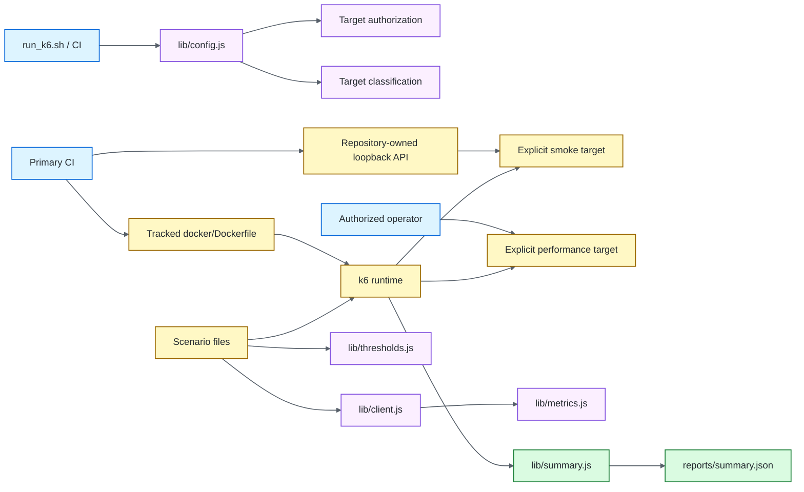

# Architecture

## Design objective

The k6 framework separates **target ownership**, **traffic shape**, **business/request helpers**, **quality thresholds**, **authorization**, **fixture lifecycle**, **packaged runtime**, and **evidence** so changing one concern does not silently redefine the others.

Traffic generation remains native k6. Shared modules centralize policy but do not create a second load-test DSL. Required CI never depends on a public demonstration service.

## Explicit target and correlation configuration

`K6_BASE_URL` is required for every traffic-capable invocation and is validated during module initialization. There is no public-service fallback.

The value must:

- be present and nonblank;
- be an absolute HTTP(S) URL;
- contain no URL user-info/credentials;
- contain no query string or fragment;
- contain a syntactically valid hostname;
- use a numeric port in the range 1–65535 when a port is present;
- preserve optional path prefixes.

The parsed target hostname is normalized and used for exact sustained-load allowlist comparison. Missing target ownership is a configuration error before k6 can execute traffic.

`K6_RUN_ID` is a bounded correlation token, not free-form text. Supplied values are trimmed and must contain only 1–128 ASCII letters, digits, dots, underscores, colons, or hyphens. This protects HTTP header semantics and retained run evidence from whitespace/control-character injection or unbounded cardinality.

`scripts/run_k6.sh` independently refuses an unset `K6_BASE_URL` before invoking k6. This shell check improves operator feedback; `lib/config.js` remains the definitive target/correlation validation boundary for direct `k6 run` execution.

## Target classification

`lib/config.js` records a structural `targetClass` alongside the validated hostname:

- `local-fixture` for loopback fixture hosts (`127.0.0.1`, `localhost`, `::1`);
- `explicit-target` for every other validated host.

Classification is evidence, not authorization. An `explicit-target` still requires sustained-load opt-in and exact allowlisting for load/stress/soak. A local classification does not imply permission for arbitrary traffic either; it identifies only the target type used in summaries.

## Repository-owned smoke fixture

`scripts/local-api.js` is the deterministic HTTP dependency for required smoke CI. It uses only Node.js built-ins and binds to `127.0.0.1` on port `4020` by default.

The fixture exposes only the behavior needed by the smoke contract:

- `GET /health` for bounded readiness detection;
- `GET /posts/1` for the k6 request/content/metric path;
- a deterministic JSON 404 envelope for all other routes.

The fixture does not emulate a production provider and is not capacity evidence. Its role is to prove k6 script initialization, real HTTP transport, JSON/content checks, metrics, thresholds, and summary generation without DNS, TLS, public API uptime, third-party data drift, or rate-limit coupling.

Primary CI owns fixture lifecycle explicitly: start the Node process, poll `/health` with a bounded deadline, execute the tracked k6 container, and always terminate the fixture. Linux host networking allows the k6 container to reach the runner-owned loopback service without introducing a remote dependency.

## Packaged runtime ownership

`docker/Dockerfile` is the single repository-owned runtime/provenance source used by CI. Its digest-pinned official `grafana/k6:<version>` stage is an upstream release marker for Docker Dependabot; the executing binary is rebuilt from the exact `K6_VERSION` tag and `K6_COMMIT` with a digest-pinned patched Go toolchain. The build verifies that the fetched tag resolves to the committed source revision before compiling.

CI derives the expected runtime version from the official release-marker `FROM` reference and compares it with the rebuilt image's `k6 version`. A Dependabot marker update therefore fails closed until the reviewed source version/commit are synchronized. The final Alpine runtime is separately pinned and scanned after build so OS fixes and vulnerabilities compiled into the Go binary are treated as distinct concerns.

The custom rebuild is deliberate: changing only Alpine packages cannot remediate vulnerabilities compiled into the k6 binary. The produced image remains non-root and its default command is `k6 version`, so starting it without explicit `run ...` arguments generates **zero traffic**.

Extended `inspect` and primary smoke gates use the same tracked image. Guardrails, runtime-version verification, built-image Trivy, and exact source-revision verification make provenance drift a failing condition rather than a documentation convention.

## Defense-in-depth authorization

Smoke is deliberately low-volume and does not require the sustained-load opt-in. `load`, `stress`, and `soak` are disabled unless **all** conditions hold:

1. `K6_BASE_URL` explicitly identifies the target;
2. `K6_ALLOW_LOAD_TEST=true`;
3. the exact parsed target hostname appears in `K6_ALLOWED_HOSTS`.

This policy exists at multiple boundaries on purpose:

- `scripts/run_k6.sh` rejects missing target ownership and provides early refusal for missing sustained opt-in/allowlist;
- `lib/config.js` rejects unsafe or absent targets/correlation for any direct invocation;
- `requireLoadAuthorization()` enforces sustained authorization even when an operator bypasses the shell wrapper.

The environment flag and hostname allowlist are intent/safety guardrails. They are not proof of legal or operational authorization; target ownership, test windows, change control, and production safeguards remain external responsibilities.

## CI safety verification

Primary CI has a dedicated guardrail stage before smoke execution. The shell contract uses a stub k6 binary, so refusal behavior is tested with zero network traffic.

CI also invokes `k6 inspect` against sustained scenarios to prove initialization rejects missing authorization, target mismatch, unsafe URLs, and unsafe correlation input without executing the configured traffic scenario.

Only after guardrails pass does smoke start the repository fixture and execute the bounded smoke profile.

## Scenario model

Scenario files own workload shape:

- smoke → tiny shared-iteration correctness signal;
- load → ramping arrival rate around expected service demand;
- stress → increasing arrival rates beyond normal expectations;
- soak → sustained constant arrival rate for time-dependent degradation.

Arrival-rate executors describe requested throughput independently from virtual-user iteration speed. `preAllocatedVUs`/`maxVUs` are generator capacity, not the performance objective.

## Request/client boundary

`lib/client.js` centralizes repeated HTTP behavior, request/run headers, endpoint tags, JSON/content-type checks, and custom metric updates. Scenario files should express user/traffic behavior rather than duplicate protocol boilerplate.

The helper treats its explicit `endpoint` argument as authoritative. Optional caller tags are merged first, then endpoint is applied so callers cannot overwrite the stable low-cardinality endpoint dimension used by metrics and thresholds.

Do not hide k6's HTTP API behind a large generic abstraction.

## Business metrics and thresholds

Built-in request/check metrics are augmented by:

- `business_attempts` (`Counter`);
- `business_success` (`Rate`);
- `business_failures` (`Rate`);
- `business_duration` (`Trend`).

The client updates these from the same endpoint/scenario tag set used by HTTP/check metrics. `lib/thresholds.js` remains the common threshold-policy source.

Important distinctions:

- threshold = pass/fail objective;
- stage/rate = requested traffic;
- VU capacity = ability to generate schedule;
- `dropped_iterations` = generator capacity/scheduling shortfall;
- business metrics = application-level outcome defined by the helper.

## Summary evidence

`handleSummary()` emits compact stdout plus `reports/summary.json`. Structured evidence includes validated run/target identity, target class, request/error/latency/check headlines, business metrics, and explicit threshold breaches.

Threshold failures must be interpreted together with achieved volume and dropped iterations. A p95 breach at a materially different achieved throughput answers a different question than a p95 breach at the planned rate.

For required smoke CI, target identity is the repository loopback fixture. Sustained evidence must identify the approved target/run so service telemetry can be correlated independently.

## Failure-domain separation

| Failure | First owner |
| --- | --- |
| Missing/unsafe `K6_BASE_URL` | Target configuration |
| Unsafe `K6_RUN_ID` | Correlation/evidence identity |
| Missing sustained opt-in/allowlist | Authorization guardrail |
| Local fixture syntax/startup/readiness | Repository smoke infrastructure |
| Docker version/default-command check | Packaged runtime ownership |
| k6 module/inspect failure | Framework/profile initialization |
| Smoke HTTP/content failure | Request/client contract or local fixture |
| Business metric/check failure | Application-level contract |
| Threshold breach | Service objective / experiment result |
| Dropped iterations | Generator/scheduling capacity |
| Container/runtime failure | Execution infrastructure |

## Extension rules

New performance behavior should:

1. require explicit target ownership before traffic;
2. preserve target validation/authorization/correlation boundaries;
3. keep required CI independent of public APIs/external uptime;
4. keep ordinary CI limited to repository-owned low-volume smoke plus zero-traffic guardrails;
5. preserve the Dockerfile as the single tracked runtime/provenance source;
6. choose an executor matching the performance question;
7. keep threshold policy centralized/reviewable;
8. preserve authoritative low-cardinality tags;
9. distinguish generator saturation from service/business failures;
10. retain machine-readable summary evidence with target classification/business metrics;
11. require explicit environment ownership/change control for sustained profiles.